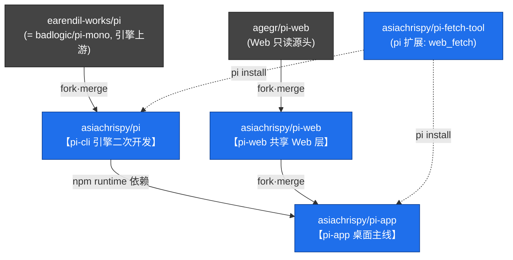

# pi-agent — Pi 三条产品线统一管理工作区

本目录用于**统一管理 Pi 生态的多个仓库**，方便在本地一起查看、二次开发与定期合并上游。

> 本 README 是「工作区说明书」，由我们自己维护，**不属于任何上游仓库**，因此不会影响各子仓库与上游的合并。
> 改 `pi` / `pi-web` / `pi-app` 里**共有文件**都会增加未来 merge `upstream` 的冲突，需遵循 §5 的「结构等价」原则。

---

## 1. 仓库总览

三条线结构对称：每个目录都是「我们的 fork（`origin`，可推送）+ 只读上游（`upstream`）」。

| 目录 | 角色 | origin（我们的 fork，可推送） | upstream（只读·定期合并） |
|------|------|------------------------------|--------------------------|
| `pi` | 引擎 / CLI | `asiachrispy/pi` | `earendil-works/pi` |
| `pi-web` | 纯浏览器 Web fork | `asiachrispy/pi-web` | `agegr/pi-web` |
| `pi-app` | macOS 桌面 fork（主线） | `asiachrispy/pi-app` | `asiachrispy/pi-web`（分层·见下） |
| `pi-fetch-tool` | pi 扩展（`web_fetch`）·**已废弃** | `asiachrispy/pi-fetch-tool` | —（改用社区 `pi-web-access`） |

> ⚠️ **关键约束**：源头 `agegr/pi-web` 与 `earendil-works/pi` 我们**无写权限**（只读 `upstream`）。但我们对每条线都有**可写的 fork**（`asiachrispy/*`），二次开发都落在 fork 上。对共有文件的改动（如 i18n）是**无法回馈源头的永久 fork 差异**，治理目标是让它「易于持续合并」而非「消除」。
>
> **已采用分层模型**：`agegr/pi-web` → `asiachrispy/pi-web`（共享 Web 层）→ `asiachrispy/pi-app`（桌面层）。通用 Web 改动只在 pi-web 做一次，pi-app 合并 pi-web 自动获得。详见 [`docs/pi-web-merge-maintenance.md`](docs/pi-web-merge-maintenance.md) §5。

经探测：`earendil-works/pi` 与 `badlogic/pi-mono` 是**同一个引擎上游**；`badlogic/pi-web` 不存在——`agegr/pi-web` 即 pi-web 这条线的原创源头。

---

## 2. 三条产品线的边界（职责互斥，避免功能交叉）



| 产品线 | 只负责 | 明确不做 |
|--------|--------|----------|
| **pi-cli**（`pi`） | Agent runtime、多 provider LLM、工具调用、会话 `jsonl` 格式、扩展机制、RPC 协议、TUI、`pi` 命令 | 任何 Web / GUI / 产品化文案 |
| **pi-web**（`pi-web`） | 跨平台纯 Web UI：会话浏览 / 对话 / 分支 / 模型切换 | macOS 壳、原生桥、桌面专属能力 |
| **pi-app**（`pi-app`） | `.app` 薄壳（WKWebView + 内嵌 Node）、`piNative` 原生桥、PWA、产品化白话 UI、远程 / 推送 / 场景 | 重新实现对话 / 分支 / 会话读取等 Web 核心逻辑 |

三者共享同一数据契约 `~/.pi/agent/`（`auth.json` / `settings.json` / `sessions/` / `models.json`，可用 `PI_CODING_AGENT_DIR` 覆盖），这是协作纽带，不算交叉。

---

## 3. git 同源事实（为什么不是“两份重复代码”）

- `pi-app` 与 `pi-web` **首提交 hash 完全相同**（`95c7a655`）→ `pi-app` 是 `pi-web` 的 **git 下游 fork**。
- `pi-web` 的 HEAD 正是两者的最近共同祖先，**`pi-app` 已包含 `pi-web` 的全部提交**，仅多出我们自己的二次开发提交。
- 即：`pi-app = 最新的 pi-web + 我们的二次开发`，并通过 `git merge upstream/main` **持续吸收 pi-web 上游**。

因此所谓“重复”是同一条 git 线上的二次开发，不是两份失控拷贝。

---

## 4. 上游合并工作流

约定：`origin` = 我们的 fork（可推送）；`upstream` = 只读源头。三条线的 `upstream` push 地址都已禁用（`DISABLE_PUSH_UPSTREAM`），防止误推；并已启用 `git rerere`（记忆冲突解法，便于反复合并）。

```bash
# pi 引擎：合并上游 → 推回我们的 fork
cd pi      && git fetch upstream && git merge upstream/main && git push origin main

# pi-web 纯 Web fork：合并上游 → 推回我们的 fork
cd pi-web  && git fetch upstream && git merge upstream/main && git push origin main

# pi-app 桌面主线：upstream 是 asiachrispy/pi-web（分层）→ 推回我们的 fork
cd pi-app  && git fetch upstream && git merge upstream/main && git push origin main
```

**分层下的合并顺序**：上游有更新时，先在 `pi-web` 合并 `agegr/pi-web` 并推送，再在 `pi-app` 合并 `pi-web`。这样通用 Web 改动和上游更新都经 pi-web 这一层统一下传，pi-app 不必直接面对 `agegr`。完整合并维护（merge 策略、冲突原则、工具）见 [`docs/pi-web-merge-maintenance.md`](docs/pi-web-merge-maintenance.md)。

---

## 5. 二次开发治理规则（核心：让上游可持续低冲突合并）

前提：源头（`agegr/pi-web`、`earendil-works/pi`）**只读不可改**，对共有文件的改动无法回馈、只能留在我们的 fork 里。因此二次开发改到哪里、怎么改，直接决定未来每次 merge 上游的冲突大小。目标是让永久 fork 差异**易于持续合并**。

1. **改动归属**
   - 引擎能力 → **先查 [pi.dev/packages](https://pi.dev/packages) 有无现成社区扩展**（`pi install npm:<pkg>` 写入 `~/.pi/agent/settings.json`，pi CLI 与 pi-app 共享加载，零应用改动）；无现成再自建扩展包，尽量不改 `pi` 引擎源码。
     - ⚠️ **避免重复造轮子**：`web_fetch` 自研（`pi-fetch-tool`）已被社区 `pi-web-access` 取代（其超集）；`memory` 由运行时 auto-install。详见下方 §7。注意区分**agent 层**（可被扩展替换）与 **pi-app 前端/原生层**（i18n UI、聊天内 markdown 渲染、文件预览、终端——扩展替代不了，保留自研）。
   - **通用 Web 能力**（跨平台、非 macOS）→ 进 `asiachrispy/pi-web`；pi-app 通过合并 pi-web 自动获得（分层链路）。
   - **macOS / 桌面 / 原生 / 产品化能力** → 进 `asiachrispy/pi-app`，尽量放在**新增独有文件**里，不碰共有文件。
   - 无论改哪条 fork 的共有文件，都力求**结构等价**（只替换字符串 / 最小插入，不重排 JSX），以便 git 三方合并能自动吃掉上游对同一文件其他部分的改动。
2. **`pi-web` 是可写 Web fork**：在 `asiachrispy/pi-web` 上做通用 Web 二次开发，定期从 `agegr/pi-web` 合并；维护流程见 [`docs/pi-web-merge-maintenance.md`](docs/pi-web-merge-maintenance.md)。
3. **警惕冲突地雷**：`pi-app` 已对部分 `pi-web` 共有文件做了大幅重写（如 `AppShell.tsx` ≈ 69% 不同），这些是未来 merge `pi-web` 上游的高冲突点。对共有文件**优先用扩展点 / 组合，而非整段重写**，把专属逻辑抽到 pi-app 独有的新文件（已落地示例见 §7）。
4. **i18n 冲突缓解（无法根治）**：i18n 是头号系统性冲突源且无法回馈上游，只能按「可维护的永久 fork 差异」管理——结构等价化、文案集中在 `lib/i18n`、小步频繁合并、必要时上「上游硬编码 → `t(key)`」的半自动 merge 辅助。详见 `docs/conflict-audit.md` P0。
5. **命名澄清**：`pi-web` = 我们的纯 Web fork（源头叫 `agegr/pi-web`）；`pi-app` = 我们的 macOS 桌面产品。避免在 `pi-app` 内部文档继续自称 “pi-web”。

---

## 6. 当前本地状态（建立时快照）

| 仓库 | 分支 | HEAD | 相对上游 |
|------|------|------|----------|
| `pi` | `main` | `dcf0bbc3` | 二次开发领先 `earendil-works/pi` 约 17 提交 |
| `pi-web` | `main` | `cde99d7` | `origin=asiachrispy/pi-web`，当前 = 上游 `agegr/pi-web`（尚无我们的改动） |
| `pi-app` | `main` | `e336917` | upstream=`asiachrispy/pi-web`；领先 149 提交，待合并上游 0 |

---

## 7. 相关文档 & 已落地工作

- [`docs/conflict-audit.md`](docs/conflict-audit.md) — pi-app ↔ pi-web 合并冲突审计：49 个共有文件冲突地雷清单、i18n 头号根因分析、缓解策略（上游只读、无法根治）。
- [`docs/pi-web-merge-maintenance.md`](docs/pi-web-merge-maintenance.md) — pi-web fork 合并维护手册：merge 策略、标准流程、冲突解决原则、省力工具（rerere / .gitattributes）、分层链路下的自上而下合并顺序。
- [`docs/pi-app-to-pi-web-uplift.md`](docs/pi-app-to-pi-web-uplift.md) — pi-app 149 提交的「通用能力上移」评估：分类总表、上移优先级（P1 终端面板首推）、i18n 在分层下可消除 pi-app 侧冲突、workbench 归属待决策。
- **共有组件去耦（第一步）** — [asiachrispy/pi-app#7](https://github.com/asiachrispy/pi-app/pull/7)：把 ChatInput 工具档位映射、AppShell 终端面板状态抽到独立可测模块（`lib/chat-input-tool-presets`、`hooks/useTerminalPanel`），行为不变、253 测试通过。后续按 §5 继续把专属逻辑移出共有组件。
- **采用社区扩展替代自研（web_fetch）** — 执行 `pi install npm:pi-web-access` 后，pi CLI 与 pi-app 会从共享 agent dir 自动加载。它是自研 `web_fetch` 的超集，支持搜索、抓取、PDF、YouTube、GitHub 克隆等能力。
  - 已合并 [asiachrispy/pi-app#8](https://github.com/asiachrispy/pi-app/pull/8)：下线 pi-app 的 web-fetch 胶水（`WebFetchSettings`/3 路由/`piNative.webFetch` 类型/i18n），净删 674 行，未动 macOS Swift。
  - 已合并 [asiachrispy/pi-fetch-tool#1](https://github.com/asiachrispy/pi-fetch-tool/pull/1)：标记 `pi-fetch-tool` 废弃，指向 `pi-web-access`。
  - 已合并 [asiachrispy/pi-app#9](https://github.com/asiachrispy/pi-app/pull/9)：移除 macOS Swift 端 webFetch 死代码（`HiddenWebFetcher`、`PiNativeBridge.webFetch`、空测试目标），净删 402 行；保留核心原生能力，并补 `PiNativeBridgeTests` 覆盖既有 piNative 注入与 `webFetch` 移除。
  - 剩余 npm registry 废弃标记需发布权限和 OTP：

    ```bash
    npm deprecate pi-fetch-tool "use pi install npm:pi-web-access" --otp=123456
    ```

    如需在 CI 执行，可创建勾选 **Bypass 2FA** 的 Granular Access Token（Read and write，范围限 `pi-fetch-tool`），再追加 `--//registry.npmjs.org/:_authToken=$NPM_TOKEN`。
