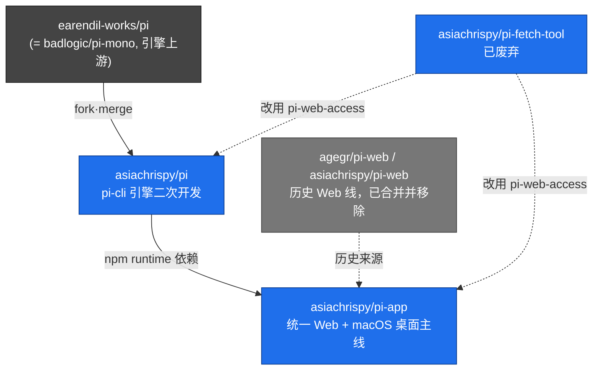

# pi-agent — Pi 工作区维护说明

本目录用于维护 Pi 生态相关仓库的本地协作规范与历史记录。

> 本 README 是「工作区说明书」，由我们自己维护，**不属于任何上游仓库**，因此不会影响各子仓库与上游的合并。
>
> **当前状态**：`pi-web` 已移除，不再作为独立仓库维护；此前沉淀在 `pi-web` 的共享 Web 能力已经合并进 `pi-app`，后续 Web UI 与桌面产品统一在 `pi-app` 维护。

---

## 1. 仓库总览

当前活跃维护两条主线：

| 目录 | 角色 | origin（我们的 fork，可推送） | upstream（只读·定期合并） |
|------|------|------------------------------|--------------------------|
| `pi` | 引擎 / CLI | `asiachrispy/pi` | `earendil-works/pi` |
| `pi-app` | 统一 Web + macOS 桌面主线 | `asiachrispy/pi-app` | 以 `pi-app` 仓库当前 `upstream` 配置为准 |
| `pi-fetch-tool` | pi 扩展（`web_fetch`）·**已废弃** | `asiachrispy/pi-fetch-tool` | —（改用社区 `pi-web-access`） |
| `pi-web` | **历史仓库，已移除** | 曾为 `asiachrispy/pi-web` | 曾为 `agegr/pi-web` |

关键约束：

- `pi-web` 不再单独拉取、合并、开发、打包或发布。
- 所有 Web UI、PWA、产品化界面、远程访问、推送、macOS 壳与原生桥相关改动，统一落到 `pi-app`。
- 引擎、CLI、agent runtime、工具调用、会话协议与扩展机制相关改动，仍落到 `pi`。
- 源头 `earendil-works/pi` 我们无写权限；对上游共有文件的改动属于长期 fork 差异，目标是让它易于持续合并。

经探测：`earendil-works/pi` 与 `badlogic/pi-mono` 是同一个引擎上游；`badlogic/pi-web` 不存在，历史上的 pi-web 源头是 `agegr/pi-web`。

---

## 2. 产品线边界



| 产品线 | 只负责 | 明确不做 |
|--------|--------|----------|
| **pi-cli**（`pi`） | Agent runtime、多 provider LLM、工具调用、会话 `jsonl` 格式、扩展机制、RPC 协议、TUI、`pi` 命令 | Web / GUI / macOS 壳 / 产品化文案 |
| **pi-app**（`pi-app`） | Next.js Web UI、PWA、`.app` 薄壳（WKWebView + 内嵌 Node）、`piNative` 原生桥、产品化白话 UI、远程 / 推送 / 场景 | 重新实现 agent runtime、工具系统、模型 provider、会话底层协议 |

两者共享同一数据契约 `~/.pi/agent/`（`auth.json` / `settings.json` / `sessions/` / `models.json`，可用 `PI_CODING_AGENT_DIR` 覆盖），这是协作纽带，不算交叉。

---

## 3. pi-web 的历史定位

`pi-app` 与 `pi-web` 历史上同源：`pi-app` 起初是 `pi-web` 的 git 下游 fork，后来在桌面壳、远程能力、i18n、文件预览、终端、产品化入口等方向持续扩展。

此前曾采用过分层模型：

```text
agegr/pi-web -> asiachrispy/pi-web -> asiachrispy/pi-app
```

该模型已经停止使用。当前结论是：

- `pi-web` 目录从本工作区移除。
- `asiachrispy/pi-web` 不再作为共享 Web 层维护。
- 以前“上移到 pi-web”的治理策略停止执行。
- 后续 Web 通用能力直接在 `pi-app` 里维护，避免 `pi-web` / `pi-app` 双线同步成本。

旧文档仅作为历史决策记录保留，见 §7。

---

## 4. 上游合并工作流

约定：`origin` = 我们的 fork（可推送）；`upstream` = 只读源头。合并前若工作区有未提交改动，先提交或暂存，不在脏树上合并。

```bash
# pi 引擎：合并上游 → 验证 → 推回我们的 fork
cd pi
git fetch upstream
git merge upstream/main
git push origin main

# pi-app：统一维护 Web + 桌面 → 验证 → 推回我们的 fork
cd ../pi-app
git fetch upstream
git merge upstream/main
git push origin main
```

执行要点：

- 不再进入 `pi-web` 目录执行同步，也不要求“先 pi-web 后 pi-app”。
- `pi-app` 的 `upstream` 以仓库实际配置为准；若后续调整远程，只需保持“`pi-app` 自己直接同步上游”的原则。
- 合并后必须验证再打包或发布：`tsc --noEmit` + `vitest run`；`pi-app` 还需按发布目标执行 `swift build` / `swift test`。
- 合并若有冲突，优先保留双方真实意图；对 `pi-app` 已成熟的产品化实现，不因历史 `pi-web` 形态而回退。
- 若上游本次无更新（落后 0），记录“已确认最新”即可，无需空合并。

---

## 5. 二次开发治理规则

1. **改动归属**
   - 引擎能力 → 先查 [pi.dev/packages](https://pi.dev/packages) 有无现成社区扩展；无现成再自建扩展包，尽量不改 `pi` 引擎源码。
   - Web UI / PWA / 产品化 / macOS / 远程 / 推送 / 原生桥 → 统一进 `asiachrispy/pi-app`。
   - 已废弃或可由扩展替代的能力，不再放回核心仓库。
2. **避免重复造轮子**
   - `web_fetch` 自研（`pi-fetch-tool`）已被社区 `pi-web-access` 取代；`memory` 由运行时 auto-install。
   - 注意区分 agent 层（可被扩展替换）与 `pi-app` 前端/原生层（i18n UI、聊天内 markdown 渲染、文件预览、终端等）。
3. **降低长期 fork 差异成本**
   - 改上游共有文件时，保持结构等价：最小插入、少重排、不顺手大重构。
   - 产品化或桌面专属逻辑优先抽到 `pi-app` 独有组件、hook、lib 或 route 里。
   - 对反复冲突文件启用并维护 `git rerere` 记录。
4. **命名澄清**
   - 对外产品和当前代码主线称 `pi-app`。
   - 不再把当前 Web UI 称为 `pi-web`；`pi-web` 只指历史仓库或历史文档。

---

## 6. 打包与发布

自 v0.8.2 起，macOS 打包统一走 Next standalone 输出。

- 打包入口：`npm run package:macos`（`pi-app/scripts/package-macos-app.sh`）。
- 脚本内部用 `PI_STANDALONE=1` 触发 `output: "standalone"`。
- bundle 布局：`server.js` + 追踪后的 `node_modules` + `.next/static` + `public` + 内嵌 Node。
- `bin/pi-app.js` 检测到 `server.js` 即以 `node server.js` 启动；普通 npm 安装无 `server.js` 时回退 `next start`。
- 体积基线：Pi.app 约 224M、DMG 约 93M。若体积明显回升，先排查 standalone 是否生效。

发布前必须完成：

1. 同步 `pi` 与 `pi-app` 上游；不再同步 `pi-web`。
2. 运行验证：`tsc --noEmit`、`vitest run`，`pi-app` 还需 `swift build` / `swift test`。
3. 更新根 `CHANGELOG.md`。
4. 重新打包并冷烟验证 `/`、`/api/health`、`/api/sessions` 均 200。
5. 打 tag 并发布 GitHub Release。

---

## 7. 相关文档

- [`docs/pi-app-unified-maintenance.md`](docs/pi-app-unified-maintenance.md) — 当前维护手册：`pi-web` 移除后，`pi-app` 统一承接 Web + 桌面代码的规则。
- [`docs/conflict-audit.md`](docs/conflict-audit.md) — 历史档案：pi-app ↔ pi-web 合并冲突审计。现在仅用于理解早期 fork 差异来源。
- [`docs/pi-web-merge-maintenance.md`](docs/pi-web-merge-maintenance.md) — 历史档案：旧 pi-web fork 合并维护手册。当前流程不再执行。
- [`docs/pi-app-to-pi-web-uplift.md`](docs/pi-app-to-pi-web-uplift.md) — 历史档案：旧“通用能力上移到 pi-web”评估。当前策略已改为统一留在 `pi-app`。
- [`docs/product-team-agent-plan.md`](docs/product-team-agent-plan.md) — 产品研发组智能体方案。

---

## 8. 本地 `pi` 相对上游的增量

`pi` fork 上的主要长期差异：

| 主题 | 增量内容 | 关键文件 |
|------|----------|----------|
| RPC 树导航 + 远程驱动 | 支持会话树导航与工具命令 | `coding-agent/src/modes/rpc/*`、`core/agent-session-tree.ts`、`core/agent-session-queue.ts` |
| memory 记忆扩展 | 记忆扩展示例 + 首次运行自动安装 | `coding-agent/examples/extensions/memory.ts`、`core/ensure-memory-extension.ts` |
| Agnes AI provider + 模型 | 新增 Agnes provider 与模型、显示名、环境变量密钥 | `ai/src/providers/*`、`ai/src/models.ts` |
| package-manager 重构 | 拆分 git / npm / source-parser，新增包边界与大文件检查 | `core/package-manager-{git,npm}.ts`、`core/package-source-parser.ts` |
| AI 重试分类 / 定价 / responses 增强 | 重试错误分类、service-tier 定价、openai-responses 共享逻辑 | `ai/src/utils/retry-classification.ts`、`ai/src/providers/openai-responses*.ts` |
| system prompt 技能工作流增强 | 扩充 skill workflow 指引 | `agent/src/agent-loop.ts` |

这些增量是引擎 fork 的长期差异。每次 `merge upstream/main` 都要带着走；能由社区扩展承接的能力优先迁出核心，深度引擎改造则继续自维护。
