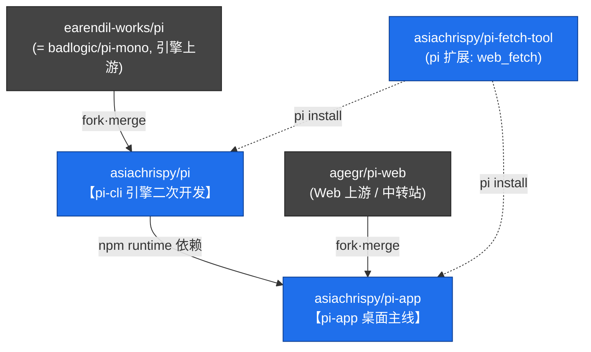

# pi-agent — Pi 三条产品线统一管理工作区

本目录用于**统一管理 Pi 生态的多个仓库**，方便在本地一起查看、二次开发与定期合并上游。

> 本 README 是「工作区说明书」，由我们自己维护，**不属于任何上游仓库**，因此不会影响各子仓库与上游的合并。
> 各子项目自带的 `README.md` 归属其各自上游，**请勿在本工作区随意修改**（`pi-web` 我们更是**无写权限的只读上游**；改 `pi` 也会增加未来 merge 冲突）。

---

## 1. 仓库总览

| 目录 | 角色 | origin | upstream（上游，只读·定期合并） |
|------|------|--------|--------------------------------|
| `pi` | 引擎 / CLI | `asiachrispy/pi`（我们的 fork，可推送） | `earendil-works/pi` |
| `pi-web` | 纯浏览器 Web 工作台（**只读上游镜像**） | `agegr/pi-web`（⚠️ **我们无写权限**） | —（它本身就是该线源头） |
| `pi-app` | macOS 桌面工作台（我们的主线） | `asiachrispy/pi-app`（我们的 fork，可推送） | `agegr/pi-web` |
| `pi-fetch-tool` | pi 扩展（`web_fetch` 工具） | `asiachrispy/pi-fetch-tool`（我们的 fork，可推送） | —（独立扩展包） |

> ⚠️ **关键约束**：`agegr/pi-web` 是只读上游，我们**无写权限**。因此所有 Web 二次开发只能落在 `pi-app` fork；对共有组件的改动（如 i18n）是**无法回馈上游的永久 fork 差异**，治理目标是让它「易于持续合并」而非「消除」。

经探测：`earendil-works/pi` 与 `badlogic/pi-mono` 是**同一个引擎上游**；`badlogic/pi-web` 不存在——`agegr/pi-web` 即 pi-web 这条线的原创源头。

---

## 2. 三条产品线的边界（职责互斥，避免功能交叉）



| 产品线 | 只负责 | 明确不做 |
|--------|--------|----------|
| **pi-cli**（`pi`） | Agent runtime、多 provider LLM、工具调用、会话 `jsonl` 格式、扩展机制、RPC 协议、TUI、`pi` 命令 | 任何 Web / GUI / 产品化文案 |
| **pi-web**（`pi-web`） | 跨平台纯 Web UI：会话浏览 / 对话 / 分支 / 模型切换 | macOS 壳、原生桥、桌面专属能力 |
| **pi-app**（`pi-app`） | `.app` 薄壳（WKWebView + 内嵌 Node）、`piNative` 原生桥、PWA、产品化白话 UI、远程 / 推送 / 场景 | 重新实现对话 / 分支 / 会话读取等 Web 核心逻辑 |

三者共享同一数据契约 `~/.pi/agent/`（`auth.json` / `settings.json` / `sessions/` / `models.json`，可用 `PI_CODING_AGENT_DIR` 覆盖），这是协作纽带，不算交叉。

---

## 3. git 同源事实（为什么不是“两份重复代码”）

- `pi-app` 与 `pi-web` **首提交 hash 完全相同**（`95c7a655`）→ `pi-app` 是 `pi-web` 的 **git 下游 fork**。
- `pi-web` 的 HEAD 正是两者的最近共同祖先，**`pi-app` 已包含 `pi-web` 的全部提交**，仅多出我们自己的二次开发提交。
- 即：`pi-app = 最新的 pi-web + 我们的二次开发`，并通过 `git merge upstream/main` **持续吸收 pi-web 上游**。

因此所谓“重复”是同一条 git 线上的二次开发，不是两份失控拷贝。

---

## 4. 上游合并工作流

约定：`origin` = 我们的 fork（可推送）；`upstream` = 上游（**只读，仅用于合并**）。
`pi` 与 `pi-app` 的 `upstream` push 地址已被禁用（`DISABLE_PUSH_UPSTREAM`），防止二次开发代码误推到上游。

```bash
# pi 引擎：合并上游
cd pi && git fetch upstream && git merge upstream/main

# pi-web 只读上游镜像：仅拉新用于查看/比对（无写权限，不在其上开发）
cd pi-web && git pull origin main

# pi-app 主线：合并 Web 上游
cd pi-app && git fetch upstream && git merge upstream/main
```

---

## 5. 二次开发治理规则（核心：让上游可持续低冲突合并）

前提：`agegr/pi-web` **只读、不可改**，i18n 等共有组件改动无法回馈上游。因此二次开发改到哪里、怎么改，直接决定未来每次 merge 上游的冲突大小。目标是让永久 fork 差异**易于持续合并**。

1. **改动归属**
   - 引擎能力 → 优先做成**扩展包**（参考 `pi-fetch-tool`），尽量不改 `pi` 引擎源码；必须改则集中、可 rebase（载体：`asiachrispy/pi`）。
   - 所有 Web 能力（含通用功能）→ 只能进 `pi-app`（上游不可改）；对共有组件的改动力求**结构等价**（只替换字符串 / 最小插入，不重排 JSX），以便 git 三方合并能自动吃掉上游对同一文件其他部分的改动。
   - macOS / 桌面 / 原生 / 产品化能力 → 尽量放在**新增独有文件**里，不碰 `pi-web` 共有文件。
2. **`pi-web` 仅作只读镜像**：本工作区的 `pi-web` 只用于查看 / 比对上游，不在其上做任何开发（也无权推送）。
3. **警惕冲突地雷**：`pi-app` 已对部分 `pi-web` 共有文件做了大幅重写（如 `AppShell.tsx` ≈ 69% 不同），这些是未来 merge `pi-web` 上游的高冲突点。对共有文件**优先用扩展点 / 组合，而非整段重写**，把专属逻辑抽到 pi-app 独有的新文件（已落地示例见 §7）。
4. **i18n 冲突缓解（无法根治）**：i18n 是头号系统性冲突源且无法回馈上游，只能按「可维护的永久 fork 差异」管理——结构等价化、文案集中在 `lib/i18n`、小步频繁合并、必要时上「上游硬编码 → `t(key)`」的半自动 merge 辅助。详见 `docs/conflict-audit.md` P0。
5. **命名澄清**：统一概念——`pi-web` = 只读上游纯 Web；`pi-app` = 我们的 macOS 产品。避免在 `pi-app` 内部文档继续自称 “pi-web”。

---

## 6. 当前本地状态（建立时快照）

| 仓库 | 分支 | HEAD | 相对上游 |
|------|------|------|----------|
| `pi` | `main` | `dcf0bbc3` | 二次开发领先 `earendil-works/pi` 约 17 提交 |
| `pi-web` | `main` | `cde99d7` | 即源头 |
| `pi-app` | `main` | `e336917` | 二次开发领先 `agegr/pi-web` 约 149 提交，待合并上游 0 |

---

## 7. 相关文档 & 已落地工作

- [`docs/conflict-audit.md`](docs/conflict-audit.md) — pi-app ↔ pi-web 合并冲突审计：49 个共有文件冲突地雷清单、i18n 头号根因分析、缓解策略（上游只读、无法根治）。
- **共有组件去耦（第一步）** — [asiachrispy/pi-app#7](https://github.com/asiachrispy/pi-app/pull/7)：把 ChatInput 工具档位映射、AppShell 终端面板状态抽到独立可测模块（`lib/chat-input-tool-presets`、`hooks/useTerminalPanel`），行为不变、253 测试通过。后续按 §5 继续把专属逻辑移出共有组件。
