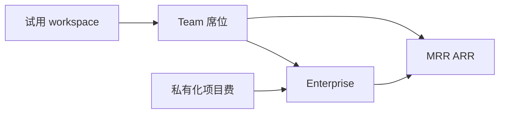
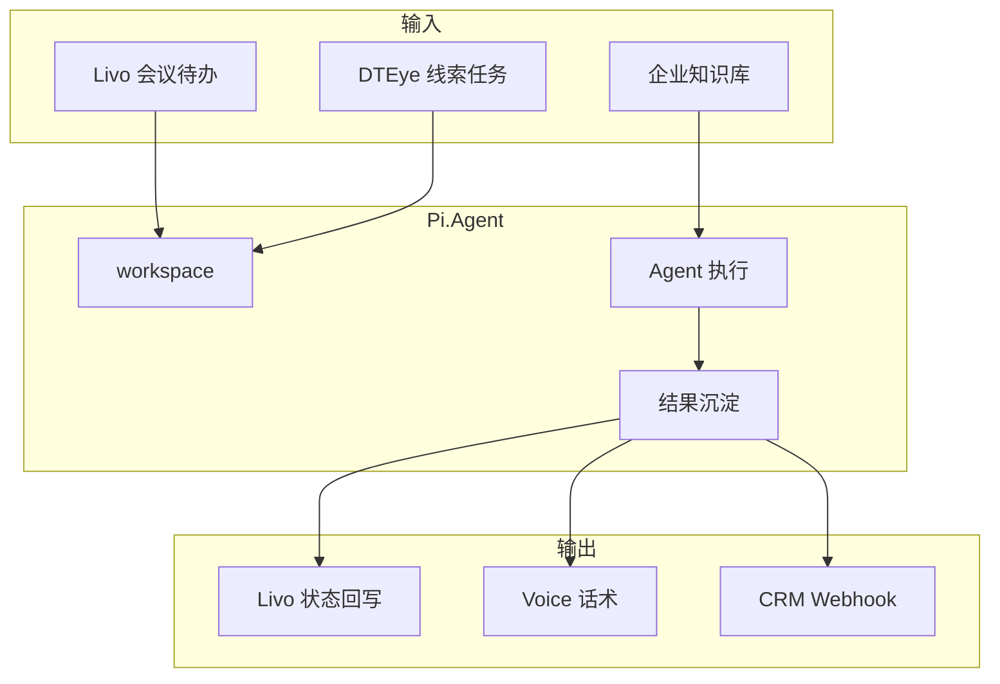

# Pi.Agent（pi-app）商业化设计方案

> **版本**：v1（Team SaaS + Enterprise，Livo SSO 身份层）  
> **状态**：战略底稿  
> **站点**：https://pi.gottao.com（产品页） / https://pi.gottao.com/app（工作台）  
> **对外文稿**：[../content/pi-product-intro.md](../content/pi-product-intro.md)  
> **集成**：[livo-pi-agent-integration.md](./livo-pi-agent-integration.md)  
> **参考**：见 Pila 仓库 `opc/product/dteye/commercialization.md`（原 livo-opc 文档于 2026-07-01 迁移）

---

## 0. 执行摘要

Pi.Agent 定位为 **企业知识库与智能体工作台 SaaS**：把分散在文档、聊天记录、SOP 中的企业知识，变成每个岗位都能调用的 AI 工作入口。

| 维度 | 定稿 |
|------|------|
| 收入模型 | **Team 席位订阅 + Enterprise 合同 + 可选私有化** |
| GTM | **Livo 会议待办导流 + 垂直 KB 案例 + inbound 诊断（轻量）** |
| 品牌 | **Pi.Agent 独立产品**；工作台 `/app`，介绍页 `/` 或 `/product.html` |
| 成功标准 | **席位 MRR、WAAT、workspace 留存** |

**North Star**：**Weekly Active Agent Tasks（WAAT）** — 付费 tenant 内每周完成至少一次「Agent 任务有明确输入、输出、状态更新」的执行数。

### 0.1 Phase 1 聚焦（M1–M3）

| 优先级 | JTBD | Phase 1 交付 |
|--------|------|--------------|
| **J1** | 「会议待办要能自动往下做」 | Livo → Pi workspace 派发 + 状态回写 |
| **J2** | 「销售/客服问答要读自家资料」 | 知识库挂载 + RAG 问答 |
| **J3** | 「Agent 过程要能追溯」 | Session / workspace 目录 + 协作记录 |
| **J4** | 「别每个员工各玩各的 ChatGPT」 | 统一工作台 + Livo SSO |

**Phase 1 价值公式**：

> **把一份企业资料或一条会议待办交给 Pi → 在可追溯的 workspace 里跑出结果，并能回写 Livo。**

**Phase 1 垂直楔子**：**Livo 用户 + 10–50 人知识密集团队**（咨询、外贸、运营）。

---

## 一、战略定位

### 1.1 一句话定位

> **Pi.Agent = 企业知识库 + 智能体工作台：统一知识、统一调度、统一沉淀。**

不是「开发者 CLI 玩具」，而是 **全员 AI 工作入口** — 本地优先、可私有化。

### 1.2 价值主张

| 受众 | 承诺 |
|------|------|
| 业务负责人 | 一个入口调用知识 + Agent，减少工具碎片化 |
| 销售/客服 | 基于真实产品资料生成回复与跟进 |
| IT | 权限可控、可私有化、与 Livo 身份打通 |

### 1.3 商业模式



**与 v1 DTEye 差异**：Pi 可保留 **轻量 inbound 诊断**（30 分钟判断 KB 落地场景），但不以咨询项目为主收入。

**生态位**：

| 产品 | 关系 |
|------|------|
| Livo | 身份 SSO + 会议待办输入 |
| DTEye | 外贸线索 → Pi 跟进自动化 |
| Voice | 知识库共用；外呼后回写 Pi |

### 1.4 竞争差异化

| 竞品 | 缺口 | Pi 填位 |
|------|------|---------|
| 企业微信 AI / 钉钉 | 平台锁定、Agent 浅 | **开放插件 + MCP + 本地目录** |
| Coze / Dify 仅搭建 | 缺「企业 KB + 全员工作台」一体 | **KB + workspace + 任务追溯** |
| Cursor / Devin | 研发向 | **非研发岗位场景 + Livo 协同** |

**品类句**：*Your company's knowledge. One agent workspace.*

---

## 二、市场（Market）

### 2.1 TAM / SAM / SOM

| 层级 | 定义 |
|------|------|
| **SAM** | 中国有「知识库 + AI 试点」需求的 20–200 人企业 |
| **SOM（首年）** | Livo 用户 + Gottao 触达 B2B | **30 Team tenant → ¥50 万 ARR** |

Team ARPU：¥12,000–24,000/年（5–10 席位）；Enterprise ¥10 万+/年。

### 2.2 切入场景（KB 楔子）

1. **销售知识库** — 产品资料、FAQ、邮件模板（与 DTEye 协同）
2. **会议待办执行** — Livo 派发（已有 v1 链路）
3. **运营/电商 SOP** — Listing、广告、竞品（Gottao 客户画像）
4. **客服知识库** — 售后 SOP + Voice Agent 共用

### 2.3 GTM 顺序

```
Livo 待办派发体验 → Pi 试用 workspace → Team 席位 → 知识库 onboarding → Enterprise inbound
```

---

## 三、客户（Customers）

### 3.1 ICP

**Primary — Team**

- 10–50 人；已有 Livo 或 Gottao 触达
- 知识散在飞书/Word/微信；希望 AI 读自家资料
- **决策周期：2–6 周**

**Secondary — Livo Pro 个人**

- 单人 workspace；待办执行 — 升 Team 触点

**Enterprise**

- 私有化、SSO、审计、专属 MCP 集成

### 3.2 Persona

| 角色 | 购买触发 |
|------|----------|
| 老板 | AI 工具太多、没有统一入口 |
| 销售主管 | 新人邮件质量不稳定 |
| 运营负责人 | SOP 查询慢、重复劳动 |
| IT | 数据要留在内网 |

### 3.3 客户旅程

| 阶段 | 触点 | 目标 |
|------|------|------|
| 认知 | Livo Studio Pi 入口 / product.html | 理解 workspace 价值 |
| 试用 | `pi.gottao.com/app` Livo SSO | 完成首次任务 |
| 转化 | 知识库挂载 + 3 次成功任务 | Team 订阅 |
| 扩展 | 多部门 KB + MCP | Enterprise |

---

## 四、场景（Scenarios）

### 4.1 核心场景

| ID | 场景 | 输入 | 输出 |
|----|------|------|------|
| **S1** | Livo 待办执行 | 会议 action item | Pi run + 状态回 Livo |
| **S2** | 销售 KB 问答 | 产品 PDF/网页 | 邮件草稿、FAQ 答复 |
| **S3** | 运营 SOP | 内部文档 | Listing/广告/复盘 |
| **S4** | 客服升级 | 工单描述 + KB | 标准回复 + 升级建议 |

### 4.2 场景优先级

| 优先级 | 场景 | Phase 1 | GA |
|--------|------|---------|-----|
| P0 | S1 Livo 派发 + SSO | ✅ | ✅ |
| P0 | S2 基础 KB 问答 | ✅ | ✅ |
| P1 | workspaceId 用户级管理 | 进行中 | ✅ |
| P1 | 插件默认集（skills/MCP/browser） | ✅ | ✅ |
| P2 | Team 多 workspace / 权限 | — | M4+ |
| P2 | MCP 企业系统连接器 | — | GA+1 |
| P3 | 私有化镜像 | — | Enterprise |

---

## 五、需求（Requirements）

### 5.1 功能需求

**P0**

| ID | 需求 | 验收 |
|----|------|------|
| F01 | Livo SSO | `/app` 未登录 → Livo → ticket → Pi cookie |
| F02 | workspace 隔离 | `livo:{userId}` 目录隔离 |
| F03 | Livo 任务派发 | `/pi-agent/tasks` 200 + deep link |
| F04 | 状态回写 | running / failed / done → Livo |
| F05 | 知识库挂载 | 文档上传 / URL；RAG 问答 |
| F06 | 默认插件集 | skills.sh / MCP / search / browser |
| F07 | product.html | 商业化介绍页 |

**P1**

| ID | 需求 |
|----|------|
| F10 | Team admin、席位 |
| F11 | workspace 列表 UI（用户可见） |
| F12 | 任务历史与导出 |
| F13 | Todo 状态同步 V1（见 integration  doc） |

**P2**

| ID | 需求 |
|----|------|
| F15 | 多 tenant 企业账号 |
| F16 | SSO SAML |
| F17 | 审计日志 Enterprise |

### 5.2 核心指标

| 指标 | 首年目标 |
|------|----------|
| Livo 用户 → 打开 Pi | ≥ 15% |
| 试用 → Team | ≥ 20% |
| WAAT / tenant | ≥ 5/周 |
| Team 年续费率 | ≥ 85% |

---

## 六、产品（Product）

### 6.1 定价（参考）

| 套餐 | 月价 | 含括 |
|------|------|------|
| **Starter** | ¥0 | Livo 用户 1 workspace；有限 Agent 额度 |
| **Team** | ¥1,499 | 5 席位；多 KB；协作记录 |
| **Business** | ¥3,999 | 15 席位；MCP 连接器；优先支持 |
| **Enterprise** | 定制 | 私有化、SSO、SLA、专属集成 |

**加购**：席位 ¥199/月；Agent 执行额度；存储/KB 容量。

### 6.2 信息架构

```
pi.gottao.com
├── product.html（商业化）
├── /（可保留 pi-agent.html 精简入口）
└── /app/
    ├── workspace 列表
    ├── session / run
    ├── 知识库
    └── 设置 / 计费
```

### 6.3 品牌

- 品牌名：**Pi.Agent**
- Logo：`pi-logo.png`
- Footer：Pi.Agent by Gottao

### 6.4 路线图

| 阶段 | 交付 | 商业目标 |
|------|------|----------|
| M1–M2 | workspaceId V1 + product.html | 10 design partner |
| M3 | Team 计费 + KB 自助 onboarding | 5 付费 Team |
| M4–M6 | MCP 模板、销售 KB 案例 | 20 Team |
| M7+ | Enterprise 私有化 | 3 Enterprise |

---

## 七、技术（Technology）

### 7.1 架构

```text
Pi Web (/app)
  → Livo SSO (ticket)
  → Pi API + workspace 文件系统
  → Pi Agent runtime (plugins, MCP, browser)
  ← Livo Backend (/pi-agent/tasks, status webhook)
```

### 7.2 关键配置

见 [livo-pi-agent-integration.md](./livo-pi-agent-integration.md)：`PI_WEB_LIVO_*`、`PI_WEB_REMOTE_TOKEN`、workspace root。

### 7.3 默认插件

| 插件 | 用途 |
|------|------|
| pi-skills-sh | 技能扩展 |
| pi-mcp-extension | 企业 MCP |
| pi-search-hub | 网页检索 |
| pi-agent-browser-native | 浏览器自动化 |

### 7.4 安全

- Pi 自有 HttpOnly cookie；不共享 `.gottao.com` JWT
- 匿名敏感 API 401
- Enterprise：VPC 部署、密钥 BYOK（路线图）

---

## 八、整体方案



---

## 九、近期行动

1. 完成 workspaceId V1（JTBD P1）
2. 上线 `pi.gottao.com/product.html`
3. Team 计费与 KB onboarding 流程
4. 销售 KB 垂直案例 + Livo 派发演示视频
5. WAAT 埋点与试用 → 付费漏斗

---

## 附录：当前产品现状（2026-06）

- 产品页：`pi.gottao.com/`（pi-agent.html）
- 工作台：`pi.gottao.com/app/` + Livo SSO
- 已上线：任务派发、协作记录、状态回写 v1
- 进行中：workspaceId 用户级管理
