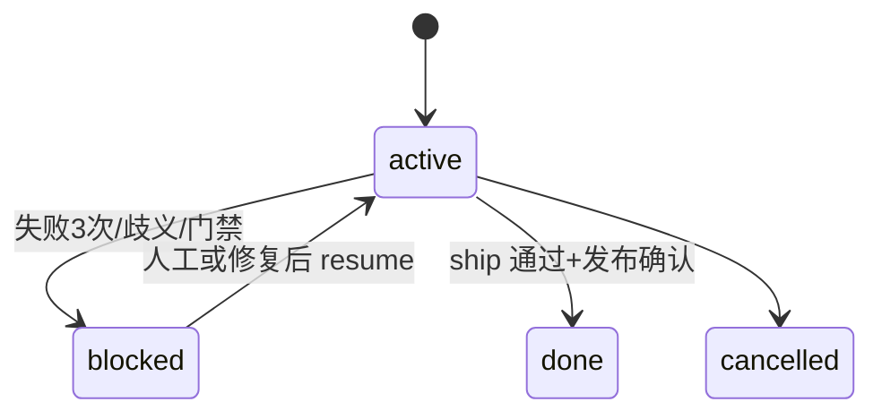

# pi-agent 企业研发自动化工作区设计方案 v3

> **状态**：草案 v3.2（用户极简 + **渐进自动化**，待 MVP 验证）
> **前序版本**：[`pi-agent-design.md`](pi-agent-design.md) v2
> **参考落地**：`../mk-lab`（PRD 接力、`jtbd-sync`、subagent、DoR skill 已验证）
> **关联文档**：[`docs/product-team-agent-plan.md`](docs/product-team-agent-plan.md)、[`AGENTS.md`](AGENTS.md)

---

## 0. v3 设计反思：如何更少人工、更高自动化

### 0.1 v2 仍让人承担的工作（问题）

| 环节 | v2 设计 | 人工负担 |
|---|---|---|
| 入口 | 6 个命令 + 手动 `/team-flow` | 人需判断调 PM/Dev/QA/Ops/Ship/Flow |
| 状态 | agent 手写 work-item frontmatter | 易漏写、与 PRD 不同步 |
| 门禁 | DoR/QA/Ops 靠 agent 自觉 | 判断不一致、难审计 |
| 小需求 | 仍建议完整 work-item 链路 | 流程过重 |
| 索引 | `sync-wiki.sh` 需人工记得跑 | 索引腐烂 |
| 开放决策 | 4 项未决 | 落地前还要开会 |

**根因**：v2 把「协议」写清楚了，但把「执行」仍主要交给 agent 自觉和人记流程。

### 0.2 v3 自动化杠杆（解法）

```mermaid
flowchart LR
    subgraph human [人只做这些]
        H1[提出意图]
        H2[确认歧义/不可逆]
        H3[批准生产发布]
    end
    subgraph machine [机器/扩展负责]
        M1[workflow-sync 写状态]
        M2[gate-checker 算门禁]
        M3[jtbd-sync 写待办]
        M4[CI validate-protocol]
        M5[/team 入口 + gate-checker]
    end
    subgraph agent [Agent 只做判断与创造]
        A1[澄清需求]
        A2[写 PRD/代码]
        A3[跑验证修失败]
    end
    H1 --> M5 --> A1
    A1 --> M1
    A2 --> M2
    A2 --> A3
    M2 -->|blocked| H2
    M2 -->|prod risk| H3
```

**人机分工原则**：

1. **机器写状态**：`workflow_update` 由 `workflow-sync` 扩展解析并写入 work-item/PRD，agent 不直接改 frontmatter。
2. **脚本验协议**：`validate-protocol.sh` + CI 检查 ID 对齐、状态合法、链接有效、DoR 字段存在。
3. **规则算门禁**：`gate-checker`（脚本或 skill）根据 diff/PRD 字段输出 `needs_qa`、`needs_ops`、`needs_exec_spec`，不靠 agent 主观。
4. **单入口路由**：用户只说 `/team <意图>`；`/team` prompt 调 `gate-checker.sh` 决定 Fast/Full 与 spec 级别。
5. **人只碰不可逆**：生产、删数、未登记脚本、重大歧义——其余默认自动链式推进。

### 0.3 双轨交付（Fast Path / Full Path）

| 轨道 | 适用 | 最小产物 | 人工触点 |
|---|---|---|---|
| **Fast Path** | 低风险、单仓库、无 Schema、预估 ≤3 文件 | 可选轻量 `wiki/exec-specs/` 笔记或仅 dev 摘要 | 0（除非验证失败 3 次） |
| **Full Path** | 中高风险、跨仓、有 PRD、需审计 | work-item + PRD + exec-spec + 完整 handoff | 仅门禁阻断与生产确认 |

**默认策略**：`gate-checker` 先判 Fast Path；升格 Full Path 时再按需创建 work-item / PRD。

### 0.4 v3 已关闭的 v2 开放决策

| 决策 | v3 默认 |
|---|---|
| wiki 命名 | 默认 `wiki/`；企业可配置 `WIKI_DIR` 环境变量或 `workspace.config.yaml`，扩展与脚本读配置，不硬编码 |
| 小改动是否必填 work-item | **否**。Fast Path 可无 work-item；升级到 Full Path 时由 `workflow-sync` 自动创建 |
| team-flow 触发 | **默认不链式**；`auto_chain: false`；用户 `/team continue` 续跑；维护者可开 auto_chain |
| JTBD 用户标识 | **`git config user.email` 优先**，fallback `user.name` slug；与 mk-lab 兼容 |

### 0.5 复杂度反思：Agent 与状态是否过多？（v3.1 共识）

针对四个实操问题，直接回答：

| 问题 | 诚实结论 | v3.1 对策 |
|---|---|---|
| 真的需要这么多 Agent Roles 吗？ | **不需要给用户看这么多**。6 个 team-* 角色是实施细节，不是用户心智模型 | **用户面 1 个 Agent + 1 条命令**；PM/QA/Ops/Ship 降为 **subagent / skill 模式**，由 `team` 内部调度 |
| 用户能记得什么时候用什么 agent 吗？ | **记不住，也不该要求记**。mk-lab 已验证：日常只记 `/mk-dev`，PM/QA/Ship 极少手动调 | 统一 **`/team <意图>`**；可选 **`/team-prd`** 给产品同学，但不进默认培训 |
| 流程节点多了，卡点能及时找到人吗？ | 靠 `next_agent: team-qa` **找不到人**。卡点必须绑 **人类 owner + 角色** | `blocked` 时写 `assignee`（人）+ `escalation_role`（产品/研发/运维），从 `project-map.md` 查负责人 |
| 这么多状态好维护吗？用户看得懂吗？ | **不好维护**。即使用 6+phase，看板仍像 Jira 轻量版 | **用户只见 4 态**；`phase` 仅机器/实施者用；看板显示中文标签 +「找谁」 |

#### 用户面 vs 实施面（关键拆分）

```text
用户记得的：                    实施者配置的（用户不可见）：
/team <意图>          →        team agent（一个 .pi/agents/team.md）
/jtbd-show                      ├─ subagent: planner（要写 PRD 时）
                                ├─ subagent: qa（gate 命中时）
                                ├─ subagent: ship（发版审计时）
                                └─ skill: ops-deploy（登记脚本执行）
                                workflow-sync 扩展（写状态、链式）
                                gate-checker 脚本（算门禁）
```

这与 [`product-team-agent-plan.md`](docs/product-team-agent-plan.md) 和 mk-lab 实测一致：**一个主力 + 按需专家**，不是六个平级角色。

#### 用户可见的 4 态（看板只显示这些）

| 显示名 | `status` | 用户理解 | 卡住了找谁 |
|---|---|---|---|
| 进行中 | `active` | AI 或同事在处理，无需你操作 | — |
| 待你确认 | `blocked` | 有歧义/风险/失败，需要你或负责人拍板 | **`assignee` 字段里的人** |
| 已完成 | `done` | 已交付 | — |
| 已取消 | `cancelled` | 不做了 | — |

`phase`（产品梳理/开发/验收/环境/发版）**不强制用户理解**——pi-app 可显示为进度条副标题，例如「开发中 · 预计下一步：自动验收」。

#### 卡点找人协议（blocked 必填）

```yaml
status: blocked
blocked:
  reason: "订单状态机与 PRD 不一致"
  assignee: "zhangsan@company.com"   # 必填：人类负责人
  escalation_role: product|tech|ops   # 产品/研发/运维
  fallback_owner: "project-map 模块负责人"
  since: "2026-06-16T10:00:00Z"
  next_action: "确认 PRD §3.2 取消单是否可回滚"
  resume: "/team REQ-2026-001"        # 处理完后一条命令继续
```

**原则**：`current_agent` / `next_agent` 给机器链式用；**`assignee` 给人类找人用**。二者不混用。

#### v3 → v3.1 删减清单

| 删减/降级 | 理由 |
|---|---|
| `team-pm` / `team-qa` / `team-ops` / `team-ship` / `team-flow` **不再作为用户命令** | 并入 `team` subagent 或扩展 |
| `phase` 10 值 **不出现在用户培训材料** | 仅 work-item frontmatter + 实施文档 |
| `draft` 宏观状态 | 合并进 `active`（Fast Path 用 `path: fast` 区分） |
| 用户记忆 `handoff_to_dev` | 保留字段，由 planner subagent 写，用户无感 |

### 0.6 第二轮反思：v3.1 仍偏重的地方（v3.2 修正）

v3.1 解决了「用户记不住 6 个 Agent、13 个状态」，但对照 mk-lab 实测和中小团队习惯，**仍有过度设计**。以下按「坦诚问题 → 修正」列出。

#### 反思 1：四层产物是否都需要？

| 产物 | v3.1 假设 | 诚实评估 | v3.2 |
|---|---|---|---|
| PRD | 产品-研发契约 | **对**，mk-lab 已验证 | 保留；Full Path / 跨人协作必填 |
| work-item | 团队状态 SoT | **多数日常可不要**。mk-lab 无 work-item 也跑通 | **按需创建**：仅 Full Path、BUG/OPS、需看板可见时自动建 |
| exec-spec | 中大需求追溯 | 有用但常写太重 | 保留；Fast Path 用 **交付摘要**（work-item 或 PRD 底部 10 行）代替 |
| JTBD | 个人待办 | **对**，零人工 | 保留；`blocked` 时自动 `add` 到 assignee 的 JTBD |

**结论**：默认链路是 **PRD（可选）→ 代码 → 验证摘要**；work-item 是「需要被看见时才生成的视图」，不是每条需求的起点。

#### 反思 2：三个新扩展，是否 Phase 1 就上？

v3.1 计划同时做 `workflow-sync` + `team-router` + `gate-checker` skill，**在单 agent 未验证前风险高**。

| 组件 | v3.2 策略 |
|---|---|
| `workflow-sync` | Phase 1b：先只解析 `workflow_update` 写 **PRD 底部进度块** 或轻量 `work-items/`，不 auto_chain |
| `team-router` | **不单独扩展**；逻辑写在 `/team` prompt + `gate-checker.sh` 调用 |
| `gate-checker.sh` | Phase 0 先做**脚本**；skill 后补 |
| 合并目标 | 远期合并为 `team-runtime` 一个扩展，避免钩子碎片化 |

**结论**：**先 mk-lab parity，再自动化加深**——不要一上来就全链 auto_chain。

#### 反思 3：auto_chain 会不会「跑飞」？

同一 session 内 pm→dev→qa→ops→ship 链式五跳：

- token 爆炸、上下文污染
- 中间失败难以定位
- 用户不知道机器在干什么

mk-lab 实测：**仅 PRD ready → 自动接力 dev** 有价值；后续 QA/Ship 跨 session 更稳。

**v3.2 链式纪律**：

| 规则 | 值 |
|---|---|
| 同 session 自动链式 | **最多 2 跳**（如 planner→team 主体，或 team→qa） |
| 跨 phase 推进 | 默认 **停止**，回复「已完成 X，输入 `/team REQ-001` 继续」 |
| 用户可说 | `/team continue` 或 `/team REQ-001` 显式续跑 |
| `auto_chain: true` | 写在 config，**默认 false**，团队成熟后再开 |

**结论**：自动化要 **可中断、可续跑**，不能黑盒跑完五段。

#### 反思 4：10 个 phase 对实施者仍太多

用户只见 4 态，但实施者维护 10 个 `phase` 仍累。

**v3.2 内部折叠为 4 phase**（与用户心智对齐）：

| `phase`（v3.2） | 包含原 v3.1 阶段 | 看板副标题 |
|---|---|---|
| `clarify` | intake, product_review, ready_for_dev | 梳理需求 |
| `build` | dev_in_progress, dev_done | 开发实现 |
| `verify` | qa_*, ops_*, test_env_done | 验收与环境 |
| `release` | ship_review | 发版审计 |

`workflow-sync` 维护细粒度进度时写入 handoff 日志即可，**frontmatter 只存 4 phase**。

#### 反思 5：PRD 是否对小需求过重？

强制 Full Path = PRD + work-item + exec-spec，小团队会绕开系统。

**v3.2 三级规格**：

| 级别 | 文件 | 何时 |
|---|---|---|
| **口头/Fast** | 无文件或会话摘要 | 改 typo、单文件、用户口头足够 |
| **轻量 spec** | `wiki/specs/SPEC-YYYY-NNN.md` 一页纸 | 单仓中等改动，无需产品正式 PRD |
| **正式 PRD** | `wiki/prd/.../REQ-*.md` | 跨人协作、高风险、要 AC 编号与 DoR |

`gate-checker` 输出 `spec_level: none|light|prd`，`team` 自动选级别。

#### 反思 6：卡点找人之后，没人响应怎么办？

v3.1 有 `assignee`，但无 **升级与可见性**。

**v3.2 补上**：

- `blocked.since` 超过 24h（可配置）→ `workflow-sync` 写 `escalated: true`，JTBD 给 `fallback_owner` 加项
- `scripts/blocked-digest.sh` 输出 standup 清单：所有 `status=blocked` + assignee + 天数
- pi-app / `JTBD/index.md` 侧边栏：**待确认（N）** 计数

#### 反思 7：和 mk-lab 的关系——先抄什么？

| 优先级 | 从 mk-lab 搬什么 | 暂不搬什么 |
|---|---|---|
| P0 | `team`≈`mk-dev`、`jtbd-sync`、subagent、PRD 模板、5 skills、wiki 索引 | work-items、workflow-sync auto_chain |
| P1 | `handoff_to_dev` 自动接力（1 跳）、`gate-checker.sh` 最小规则 | team-router 扩展、pi-app 看板 |
| P2 | work-item 按需、4 phase、blocked digest | 全链 auto_chain、approval UI |

#### v3.2 设计信条（写进培训材料的一句话）

> **一个命令交付为主；文件按需变重；状态给人看四格；机器别在后台连跑五段；卡住了必须写着找谁。**

---

## 1. Summary

pi-agent 面向中小型企业 IT 产品研发团队，用 **Git 文件协议 + Pi 扩展自动化** 连接产品、开发、测试、运维，形成可版本化、可追溯、**默认自推进** 的研发工作流。

v3.2 核心变化：

1. **用户面**：`/team` + 可选 `/team-prd`；一个 `team` agent，内部 subagent。
2. **产物按需**：work-item / PRD / exec-spec **按 gate 升格**，非默认全套。
3. **自动化节制**：同 session 链式 ≤2 跳；`auto_chain` 默认关。
4. **状态**：用户 4 态；机器 **4 phase**（clarify/build/verify/release）。
5. **卡点**：`blocked.assignee` + 24h 升级 + standup digest。

| 层 | 目录 | 何时需要 | v3.2 自动化 |
|---|---|---|---|
| 知识 | `wiki/` | 总是 | CI + sync-wiki |
| 轻量规格 | `wiki/specs/` | 中等改动 | gate 自动建 |
| 团队视图 | `work-items/` | Full Path / 缺陷 / 需看板 | 自动创建，非默认 |
| 执行追溯 | `wiki/exec-specs/` | 高风险 / 跨仓 | gate-checker 触发 |
| 个人待办 | `JTBD/` | 总是 | jtbd-sync；blocked 自动 add |

**用户日常只需记住一个命令**：`/team <需求或 work-item id>`。  
**实施上只有一个用户面 Agent**（`team`）；PM/QA/Ship/Ops 是内部 subagent，不是第二个「角色岗位」。

---

## 2. System Principles

### 2.1 MECE 分层（v3.2：work-item 降为视图层）

| 层 | 目录 | 本质 | 何时创建 |
|---|---|---|---|
| 知识 | `wiki/` | 长期真相 | 项目初始化 |
| 规格 | `wiki/prd/`、`wiki/specs/` | 需求契约 | gate 判定 `prd` 或 `light` |
| 团队视图 | `work-items/` | **索引/看板**，非第二套需求真相 | Full Path、BUG/OPS、多人跟进 |
| 执行 | `wiki/exec-specs/` | 追溯 | 高风险/跨仓 |
| 个人 | `JTBD/` | 个人行动 | 每人始终存在 |

**v3.2 原则**：PRD/spec 说「做什么」；work-item 说「谁在做、卡在哪」——没有协作追踪需求时可不建 work-item。

### 2.2 状态权威来源（审查：保留，强化自动同步）

| 问题 | 权威来源 | v3 同步机制 |
|---|---|---|
| 能否开发？ | PRD `ready_for_dev` + `dor_result` | `pm-dor-checker` skill 自动跑；`workflow-sync` 写 PRD/work-item |
| 团队进度？ | work-item（若存在）`status`+`phase`；否则 PRD/spec 底部 **## Progress** 块 | `workflow-sync` 写入 |
| 改了什么？ | exec-spec Traceability | dev agent 写表；CI 检查 AC 编号存在 |
| 个人待办？ | `JTBD/<user>-jtbd.md` | `jtbd-sync` |

**禁止**：agent 用 `edit` 直接改 work-item YAML frontmatter（prompt 与 CI 双重约束）。

### 2.3 五个闭环（审查：每项加自动触发器）

| 闭环 | 自动触发器 |
|---|---|
| 初始化 | `bootstrap-workspace.sh` 一键；`check-pi-env.sh` 进 CI |
| 知识 | PRD/ADR 变更 → CI 跑 `sync-wiki.sh` + `validate-protocol.sh` |
| 任务 | `workflow-sync` 写进度；可选单跳接力；失败 `blocked` + JTBD 通知 |
| 质量 | `gate-checker` + DoR skill + 子仓库 CI（**CI 是最终门禁**） |
| 运维 | 仅 `environments/registry.yaml` 登记脚本可执行 |

### 2.4 自动化协同原则（v3.2：节制优于极致）

- **默认单跳接力**：仅 `handoff_to_dev` 一类高价值自动接力（planner→team）；其余靠 `/team continue`。
- **`auto_chain`**：config 默认 `false`；成熟团队显式开启。
- **失败退避**：验证失败 3 次 → `blocked` + JTBD 通知 assignee。
- **产物升格**：`none → light spec → PRD → work-item → exec-spec`，由 gate-checker 逐级触发，不一步到位。
- **不自动 git push/commit**：保持。

### 2.5 非目标（审查：无变更）

数据库型 PM、自动生产部署、Git 源替代、部门硬拆 wiki——仍不做。

---

## 3. Workspace Structure

### 3.1 目录（审查：新增协议层与配置）

```text
pi-agent/
├── workspace.config.yaml      # wiki 目录名、业务仓库清单、ID 前缀、自动化开关
├── .pi/
│   ├── agents/
│   ├── prompts/
│   ├── extensions/
│   │   ├── subagent/
│   │   ├── jtbd-sync/           # 已有：JTBD 自动同步
│   │   ├── workflow-sync/       # 写状态/Progress；可选有限 auto_chain
│   │   └── (team-router 暂不独立，逻辑在 /team prompt)
│   └── skills/
│       ├── shared-prd-template/
│       ├── shared-ac-patterns/
│       ├── pm-dor-checker/
│       ├── shared-handoff-builder/
│       └── gate-checker/        # 新增：门禁规则 skill（与 scripts 双实现）
├── wiki/
│   ├── agent-reading-map.md
│   ├── workflow-usage.md        # 新增：命令与自动化行为说明（给人看）
│   ├── project-overview.md
│   ├── project-map.md
│   ├── prd/
│   ├── specs/                   # 轻量一页纸规格 SPEC-*
│   ├── exec-specs/
│   ├── environments/
│   │   └── registry.yaml        # 新增：可执行脚本登记册（机器读）
│   ├── runbooks/
│   └── validation-rules.md
├── work-items/
│   ├── .id-counter.yaml         # 新增：REQ/BUG/OPS 序号（脚本递增）
│   └── ...
├── JTBD/
├── scripts/
│   ├── bootstrap-workspace.sh
│   ├── setup-pi-entrypoints.sh
│   ├── check-pi-env.sh
│   ├── sync-wiki.sh
│   ├── sync-jtbd-index.sh
│   ├── validate-protocol.sh
│   ├── gate-checker.sh
│   ├── next-work-item-id.sh
│   └── blocked-digest.sh        # standup：列出 blocked + 天数
├── .gitlab-ci.yml               # 新增：协议 CI（不跑业务测试）
└── <business-repos>/
```

### 3.2 workspace.config.yaml（审查：消除硬编码）

```yaml
wiki_dir: wiki
business_repos:
  - name: example-api
    path: example-api
    git: git@...
automation:
  auto_chain: false         # v3.2 默认关；同 session 最多 2 跳
  auto_create_work_item: on_full_path_only
  fast_path_enabled: true
  max_verify_retries: 3
  max_chain_hops_per_session: 2
  blocked_escalate_hours: 24
jtbd:
  user_id_from: email       # email | name
```

### 3.3 审查结论

- v2 缺**机器可读配置** → v3 用 `workspace.config.yaml` + `environments/registry.yaml`。
- v2 扩展只有 jtbd → v3 补 **workflow-sync**；路由在 `/team` prompt，不单独扩展。
- v2 无 CI 协议检查 → v3 根仓库 CI 只验协议，业务测试仍在子仓库 CI。

---

## 4. pi / pi-app 职责

### 4.1 分工（审查：明确自动化归属）

| 组件 | 职责 | v3 自动化边界 |
|---|---|---|
| **pi** | runtime、扩展钩子、subagent 链式、验证 | **所有状态写入与路由在扩展完成** |
| **pi-app** | 可视化、人工确认 UI、阻塞项提醒 | Phase 5；读取文件协议，**可一键「确认继续」触发 resume token** |

### 4.2 pi-app Phase 5 增强（前瞻）

- 看板读 `work-items/` + `JTBD/index.md`。
- `blocked` / `human_confirmation_required` 项高亮，点确认后写 `approval.yaml` 片段，`workflow-sync` 读后继续链式。
- **不**在 pi-app 内改状态字段，只写**批准记录**供扩展消费。

### 4.3 审查结论

v2 说 pi-app 不替代源数据——保留。v3 补充：**人工确认也是文件协议**（`work-items/approvals/` 或 work-item 内 `## Approvals`），扩展可读可审计。

---

## 5. Knowledge System

### 5.1 agent-reading-map（审查：加 CI 维护门禁）

结构同 v2。v3 增加：

- CI 检查：reading-map 中引用的路径存在。
- 新增文档时，`validate-protocol.sh` 警告「未在 reading-map 登记」。

### 5.2 索引自动维护

| 索引 | 生成方式 |
|---|---|
| `JTBD/index.md` | `sync-jtbd-index.sh` |
| `raw/database/table-index.md` | `sync-wiki.sh` 从 SQL 解析或手工触发 |
| `prd/index.md` | `sync-wiki.sh` 扫描 frontmatter |

触发：根仓库 CI on push + 可选 `post-commit` hook（本地）。

### 5.3 environments/registry.yaml（审查：Ops Gate 机器化）

```yaml
scripts:
  - id: deploy-test-frontend
    path: scripts/deploy-test.sh
    env: test
    repos: [mk-web-business]
    smoke_check: curl -f http://test.example/health
    allowed_agents: [team]           # 通过 ops-deploy skill，非独立用户 agent
```

`team` 经 ops-deploy skill **只能**执行 registry 中 `id`；`gate-checker` 校验命令不在 registry 则拒绝。

### 5.4 审查结论

v2 Ops Gate 靠目录约定 → v3 **登记册 + 脚本 ID**，agent 传 `script_id` 而非自由 bash。

---

## 6. Work Item Model

### 6.1 用户 4 态 + 机器 4 phase（v3.2）

**用户看板只讲 4 态**（§0.5）。**机器 `phase` 也收成 4 个**（§0.6），与用户副标题一致：

| status（用户） | phase（机器） | 看板主标题 | 副标题示例 |
|---|---|---|---|
| `active` | `clarify` | 进行中 | 梳理需求 |
| `active` | `build` | 进行中 | 开发实现 |
| `active` | `verify` | 进行中 | 验收 / 环境 |
| `active` | `release` | 进行中 | 发版审计 |
| `blocked` | * | 待你确认 | 见 assignee |
| `done` | — | 已完成 | — |
| `cancelled` | — | 已取消 | — |

Handoff 日志可记录细粒度跃迁（如 `dev_in_progress→dev_done`），**不要求 frontmatter 存 10 值**。

| phase | 卡住时默认 assignee |
|---|---|
| `clarify` | owner 或产品负责人 |
| `build` | owner（研发） |
| `verify` | owner；高风险加 QA/运维负责人 |
| `release` | owner + 发布审批人 |



### 6.2 何时创建 work-item（v3.2：按需，非默认）

| 触发 | 创建 |
|---|---|
| `gate.spec_level=prd` 或跨人协作 | `work-items/REQ-*.md` |
| `/team BUG` / `/team OPS` | `BUG-*` / `OPS-*` |
| Fast Path 完成 | **不创建**；摘要写入会话或 `wiki/specs/` |
| 用户「加到看板」 | 从 PRD/spec 生成 work-item |

无 work-item 时，进度写在 PRD/spec 底部：

```markdown
## Progress
status: active
phase: build
owner: zhangsan@company.com
updated_at: 2026-06-16T10:00:00Z
summary: module 验证通过，待续 /team continue
```

### 6.3 frontmatter（审查：精简 agent 必填项）

```yaml
id: REQ-2026-001
title: ""
type: requirement|bug|ops
status: active|blocked|done|cancelled
phase: build|clarify|verify|release
path: full|fast
priority: P0|P1|P2|P3
project: ""
owner: ""                          # 人类主负责人（必填）
assignee: ""                       # blocked 时必填；平时默认同 owner
escalation_role: product|tech|ops
prd_ref: ""
exec_spec_ref: ""
related_repos: []
current_agent: team                # 用户面恒为 team；内部 subagent 名写入 handoff 日志
next_subagent: qa|planner|ship|ops # 机器链式用，非用户命令
automation_policy: auto_until_blocked
blocked: {}                        # status=blocked 时必填，结构见 §0.5
last_verification:                 # workflow-sync 写入摘要
  scope: module
  result: pass
updated_at: ""                     # ISO8601，扩展写入
```

**移除** `participants`、`created_at` 人工维护——`created_at` 由首次创建脚本写入一次。

### 6.4 正文结构（审查：handoff 日志自动化）

- **Handoff 日志**：`workflow-sync` 追加，格式固定：

```markdown
### Handoff 2026-06-16T10:00:00Z
- subagent: qa
- phase: dev_in_progress → dev_done
- summary: ...
- verification: module/pass
```

- agent 只产出 `workflow_update`，**不写 Handoff 章节**。

### 6.5 审查结论

v3.1 用户 4 态 + 10 phase → v3.2 **用户 4 态 + 机器 4 phase + work-item 按需**。

---

## 7. 需求规格与执行契约（v3.2）

### 7.0 三级规格（反思 5）

| 级别 | 路径 | gate 条件 |
|---|---|---|
| 无文件 | — | Fast Path，≤3 文件，低风险 |
| 轻量 | `wiki/specs/SPEC-YYYY-NNN.md` | 单仓中等改动，无跨团队契约 |
| 正式 PRD | `wiki/prd/<domain>/REQ-*.md` | 跨人协作、高风险、要 AC/DoR |

`gate-checker.sh` 输出 `spec_level`；`team` 自动创建对应文件，**不默认全套 PRD+work-item+exec-spec**。

轻量 spec 模板（一页）：背景、目标、不做、AC 3〜5 条、风险一行。

### 7.1 PRD（正式级）

PRD frontmatter 增加：

```yaml
handoff_to_dev: yes|no             # pm 意图；实际接力还需 ready_for_dev + dor_result pass
dor_result: pass|fail|pending      # pm-dor-checker skill 写入
dor_checked_at: ""
work_item_ref: work-items/REQ-2026-001.md
```

**自动接力条件**（与 mk-lab 一致，机器判定）：

```text
ready_for_dev == true
AND dor_result == pass
AND handoff_to_dev == yes
→ workflow-sync 继续调 `team`（内部 spawn 对应 subagent）
```

### 7.2 dev_task（审查：由 skill 生成，非人手填）

`shared-handoff-builder` skill 在 DoR pass 后**自动生成** dev_task 块写入 work-item，字段从 PRD 提取 AC 摘要。

agent 禁止手写 `dor_result: pass`；必须由 `pm-dor-checker` 输出结构化结果块：

```yaml
dor_check:
  result: pass|fail
  missing: []
  checked_at: ""
```

`workflow-sync` 将 `dor_check` 同步到 PRD `dor_result`。

### 7.3 exec-spec（审查：gate-checker 触发）

`gate-checker.sh --prd <path> [--diff <range>]` 输出：

```json
{
  "needs_exec_spec": true,
  "needs_qa": true,
  "needs_ops": false,
  "reasons": ["risk=high", "schema_change"]
}
```

满足 `needs_exec_spec` 时，`team` 启动阶段自动从 template 创建 exec-spec 文件。

### 7.4 Traceability（审查：CI 抽检）

`validate-protocol.sh` 检查 exec-spec 中每个 `AC-*` 在 PRD 中存在；不强制填满（允许 `not_verified` 表有行）。

### 7.5 审查结论

v2 dev_task 嵌入但人工填 → v3 **skill 生成 + dor_check 机器块**；exec-spec 由 gate-checker 决定。

---

## 8. Agent：一个用户面，多个内部能力（v3.1）

### 8.1 用户命令（最多记 2 个）

| 命令 | 谁用 | 频率 |
|---|---|---|
| **`/team <意图>`** | 全员 | **每天** |
| `/team-prd <需求>` | 产品（可选） | 需要正式 PRD 时；等价 `/team --prd` |
| `/jtbd-show` | 全员 | 随时 |

**不再向用户推广**：`/team-pm`、`/team-dev`、`/team-qa`、`/team-ops`、`/team-ship`、`/team-flow`。若保留，仅作维护者调试别名。

### 8.2 一个 `team` Agent，内部 subagent 调度

对齐 mk-lab `/mk-dev` 与 product-team 的「一个主力 + 按需专家」：

```text
/team
 └─ team（唯一用户面 agent）
      ├─ 默认：理解 → 实现 → 验证 → 交付摘要
      ├─ 需要 PRD → spawn subagent planner（只写 wiki/prd/**）
      ├─ gate needs_qa → spawn subagent qa（只读+验收写回）
      ├─ 发版意图 → spawn subagent ship（只审计）
      └─ registry 命中 → skill ops-deploy（只跑登记脚本）
```

用户全程只和 `team` 对话；**不知道**内部叫 qa 还是 ship。

### 8.3 写权限（按 subagent 能力包，非岗位）

| 内部能力 | 可写 | 触发 |
|---|---|---|
| `planner` | `wiki/prd/**`、`wiki/prototypes/**` | 需求模糊 / 用户 `--prd` / Full Path |
| `team`（主体） | 业务仓库、`wiki/exec-specs/**`、work-item 实现摘要 | 默认 |
| `qa` | work-item QA 段、exec-spec 验收表 | `gate-checker.needs_qa` |
| `ops-deploy` | work-item Ops 段 | `needs_ops` + registry 有脚本 |
| `ship` | work-item Ship 段 | 发版 / `phase→ship_review` |
| **workflow-sync** | frontmatter、Handoff、`blocked` | 每次 `workflow_update` |

实施上可用 **一个 `team.md` + subagent 扩展** 引用 `.pi/agents/capabilities/*.md`，不必维护 6 份独立团队岗位 agent。

### 8.4 `/team` 路由 + workflow-sync（用户无感）

```text
1. /team 解析输入
2. gate-checker 判 Fast/Full
3. 调 team agent；内部决定 spawn 哪个 subagent
4. workflow-sync 写 4 态 + phase + blocked.assignee
5. 回复用户固定句式：
   - 进行中：「在处理 REQ-001，开发中，无需操作」
   - 待确认：「REQ-001 等你确认：…，负责人 @assignee，处理后 /team REQ-001 继续」
```

### 8.5 审查结论

**不需要多个用户可见 Agent Role**。v3.1 = **1 命令 + 1 用户 Agent + 内部 subagent**；与 mk-lab 日常只记 `/mk-dev` 一致，并补上卡点找人（`assignee`）。

---

## 9. Automation Protocol

### 9.1 workflow_update（审查：扩展独占写入）

agent 最终回复**必须**包含：

```yaml
workflow_update:
  work_item: REQ-2026-001
  phase: dev_done
  status: active
  current_agent: team
  next_subagent: qa
  handoff: "3/3 AC，module 验证通过"
  blocking_reason: ""
  verification:
    scope: module
    commands: ["pnpm test:unit"]
    result: pass
  gate:
    needs_qa: true
    needs_ops: false
    needs_exec_spec: true
  human_confirmation_required: false
  resume_token: ""                   # 人工确认后填入，供链式恢复
```

### 9.1 workflow_update（v3.2：写状态，有限链式）

结构同前。`workflow-sync`（`message_end`）：

1. 解析块 → 校验 schema。
2. 有 work-item → 更新 frontmatter + Handoff；无则更新 PRD/spec `## Progress`。
3. 同步 PRD `status`（按 §2.2）。
4. **若 `auto_chain` 且本会话跳数 < `max_chain_hops_per_session`（默认 2）** → spawn `next_subagent`；否则回复续跑提示。
5. `human_confirmation_required` → `blocked` + approval 待办 + **JTBD add 给 assignee**。
6. `blocked` 超过 `blocked_escalate_hours` → `escalated` + digest + JTBD 通知 fallback。

### 9.2 JTBD（审查：无变更）

仍用 `[JTBD-UPDATE]` + `jtbd-sync`；与 workflow 并行、互不依赖。

### 9.3 人工确认（审查：可枚举 + 可恢复）

| 场景 | 检测方式 | 恢复方式 |
|---|---|---|
| 生产部署 | agent 输出含 `prod_deploy` 或 Ship 标记 | 人写 approval → `resume_token` |
| 生产 DB 变更 | gate-checker `schema_change` + env=prod | 同上 |
| 删数据 | 命令模式匹配 + agent 声明 | 同上 |
| 验证失败 3 次 | workflow-sync 计数 | 人修复后 `/team <id>` 或 approval |
| 重大歧义 | agent `blocking_reason: ambiguity` | 人补充 PRD 后 resume |

### 9.4 loop 与链式纪律（v3.2）

| 约束 | 默认 |
|---|---|
| 同 session 链式跳数 | ≤ 2 |
| 验证失败重试 | ≤ 3 |
| 跨 phase（如 build→verify） | 需 `/team continue` 除非 `auto_chain: true` |
| 超约束 | `blocked`，reason=`chain_limit` 或 `verify_retries` |

mk-lab 已验证的 **PRD ready → dev 单跳** 保留为默认开启的一跳接力，不计入「过度链式」。

### 9.5 审查结论

v2 人工调 `/team-flow` → v3 **扩展默认链式 + approval 文件恢复 + 退避上限**。

---

## 10. Quality and Ops Gates

### 10.1 门禁双实现（审查：可审计）

| 门禁 | skill（agent 读） | script（CI/扩展调） |
|---|---|---|
| DoR | `pm-dor-checker` | `validate-protocol.sh --dor` |
| QA | `gate-checker` skill | `gate-checker.sh` |
| Ops | registry 查找 | `gate-checker.sh --ops` |
| Ship | `team-ship` 检查清单 | 子仓库 CI 结果 + diff stat |

**原则**：agent 判断与脚本结果冲突时，**以脚本为准**，agent 标记 `blocked`。

### 10.2 DoR / DoD / QA / Ops / Ship（审查：内容保留，触发自动化）

内容与 v2 相同。v3 仅改变**触发方式**：

- DoR：`planner` subagent 或 `team --prd` 结束前自动跑 skill。
- QA：`needs_qa: true` 自动调，非人手。
- Ops：仅 `registry.yaml` 的 `script_id`。
- Ship：发版意图或 `phase=ship_review` 自动调。

### 10.3 审查结论

v2 门禁靠自觉 → v3 **gate-checker 双实现 + CI 终检**。

---

## 11. Implementation Phases（v3.2：MVP 优先）

| Phase | 目标 | 交付物 | 验收 |
|---|---|---|---|
| **MVP** mk-lab parity | 能日常开发 | `team`≈`mk-dev`、`jtbd-sync`、subagent、wiki 骨架、5 skills、`/team` | 1 个需求闭环，无 work-item |
| **0** 协议 CI | 可验可查 | `gate-checker.sh`（最小）、`validate-protocol.sh` | CI 绿 |
| **1a** 状态写入 | 进度可见 | `workflow-sync` 只写 Progress/轻量 work-item，**无 auto_chain** | 进度块正确 |
| **1b** 单跳接力 | PRD→dev | `handoff_to_dev` 自动 1 跳 | 与 mk-lab 等价 |
| **2** 按需看板 | 协作可见 | work-item 按需、`blocked`+digest、4 phase | 1 个 Full Path 样本 |
| **3** 有限链式 | 可选自动化 | `auto_chain` 可配置、≤2 跳 | 团队 opt-in 验证 |
| **4** Ops registry | 环境闭环 | `environments/registry.yaml` | 登记脚本冒烟 |
| **5** pi-app | 4 态看板 | 待确认计数、approval | 与 Git 一致 |

**原则**：MVP 未验证前，不做 work-item 全套、不做五跳 auto_chain、不做独立 team-router 扩展。

### 11.1 mk-lab 迁移映射

| mk-lab | pi-agent v3 |
|---|---|
| `mk-erp-wiki/` | `wiki/`（或 config 指定） |
| `mk-pm` handoff | `handoff_to_dev` + `workflow-sync` |
| `jtbd-sync` | 原样 |
| `subagent` | 原样，供 auto_chain |
| 5 skills | 原样 + `gate-checker` |

---

## 12. Test Plan

### 12.1 样本（审查：加自动化回归）

| 样本 | 路径 | 人工操作上限 |
|---|---|---|
| 纯前端小改 | Fast Path | 只输入 `/team ...` 一句 |
| 前后端联动 | Full Path | 0 命令切换；仅验证失败时介入 |
| 高风险 | Full Path + 自动 QA | 确认 Ship 报告（可不改代码） |
| 测试环境演练 | Ops registry | 登记脚本执行；无临时 bash |

### 12.2 自动化回归（新增）

| 用例 | 断言 |
|---|---|
| `workflow-sync` 解析 | frontmatter `phase` 正确 |
| `gate-checker` | 给定 fixture diff 输出预期 JSON |
| `validate-protocol` | 坏链接触发 CI fail |
| auto_chain 深度 | 第 6 跳自动 blocked |
| JTBD | `[JTBD-UPDATE]` 写入正确文件 |

### 12.3 成功标准（v3.2）

| 指标 | MVP | 成熟（Phase 2+） |
|---|---|---|
| 用户命令/样本 | 1（`/team`） | 1 |
| 手动改 frontmatter | 0 | 0 |
| 无 work-item 的 Fast 样本占比 | ≥50% 允许 | 按团队 |
| blocked 有 assignee | — | 100% |
| blocked >24h 无 escalated | — | 0 |

---

## 13. Assumptions

- 多数需求可由 **一个 team agent** 闭环，与 mk-lab 一致。
- work-item 是**协作视图**，不是每条需求的必需品。
- `auto_chain` 默认关闭，避免黑盒长跑。
- 生产发布与生产库变更始终需人工 approval。
- 团队规模中小（多数需求一人全栈），流程为其优化而非大厂职能流水线。

---

## Appendix A：版本演进审查记录

| 版本 | 核心问题 | 对策 |
|---|---|---|
| v2 | 6 角色、13 状态、人写状态 | 文件协议 + work-item |
| v3 | 自动化但扩展过多、auto_chain 五跳 | workflow-sync、gate-checker |
| v3.1 | 用户仍怕多 Agent、phase 难懂 | 单用户面、4 用户态、assignee |
| **v3.2** | 四层产物仍重、扩展过早、链式跑飞 | 产物按需、MVP 优先、4 phase、链式≤2、auto_chain 默认关 |

### v3.2 逐章审查摘要

| 章节 | 仍缺什么 | v3.2 补什么 |
|---|---|---|
| Summary | 与 mk-lab 落地点对不齐 | MVP parity 优先 |
| Principles | work-item 与 PRD 双真相风险 | work-item 降为视图 |
| Workspace | 扩展碎片化 | 暂不独立 team-router |
| Work Item | 默认创建太重 | on_full_path_only |
| PRD | 小需求被迫 PRD | 三级 spec_level |
| Automation | auto_chain 失控 | 默认 false，2 跳上限 |
| Phases | 一上来 Phase 0-5 | 先 MVP |
| 卡点 | 无升级机制 | digest + 24h escalate + JTBD |

---

## Appendix B：扩展接口草案（workflow-sync，v3.2）

```typescript
// message_end: 解析 workflow_update
// 有 work_item → 写 frontmatter；无 → 写 PRD/spec ## Progress
// auto_chain && hops < max_chain_hops_per_session → spawn next_subagent
// 否则 endTurn("输入 /team continue 继续")
// blocked → jtbd-sync 给 assignee 加待办；超 escalate_hours → fallback
```

`/team` prompt 内路由（**非独立扩展**）：调 `gate-checker.sh` → 决定 spec_level / Fast|Full。

---

## Appendix C：与 product-team / mk-lab 的对齐

| 来源 | v3.2 落地 |
|---|---|
| product-team：一个主力 | `team` 唯一用户面 |
| product-team：QA/Ship 按需 | gate 触发 subagent，非日常命令 |
| mk-lab：日常 `/mk-dev` | `/team` 默认等同 dev 闭环 |
| mk-lab：无 work-item | MVP 不建 work-item；Full Path 再建 |
| mk-lab：PRD ready 单跳 dev | Phase 1b，唯一默认 auto 链式 |
| mk-lab：JTBD 零人工 | 保留；blocked 联动 JTBD |

**一句话**：v3.2 = mk-lab 能用的先搬过来，再按需加看板与节制版自动化，而不是先画完整流水线再逼团队学。
