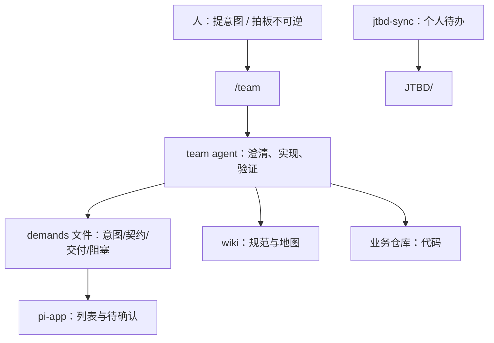

# pi-agent 企业研发自动化工作区设计方案 v4

> **状态**：草案 v4（目标驱动版）
> **前序版本**：[`pi-agent-design-v3.md`](pi-agent-design-v3.md)
> **范围**：本工作区如何用 Pi / Pi.app 服务研发团队；不讨论业务仓库内部架构

---

## 0. 从目标出发，而不是从机制出发

v3 的问题不是「写得不够细」，而是 **机制堆得太早、离目标太远**：扩展、门禁、双轨、多类文件、多 phase 并列，读者很难回答「我到底要干什么」。

v4 只做一件事：**先写清要达成什么，再推导最少必要设计**。下文不出现「对标某仓库」——只围绕 pi-agent 自己要解决的问题。

### 0.1 六个目标（North Star）

| ID | 目标 | 成功时团队感受到什么 |
|---|---|---|
| **G1 交付** | 需求更快变成可运行、可验证的改动 | 说一句意图，能得到代码 + 测试结果 + 能否上线结论 |
| **G2 追溯** | 事后能查：做了什么、依据什么、验了什么 | 一个月后仍能对着一份记录复盘，不翻聊天记录 |
| **G3 协作** | 多人能看见：谁在做什么、卡在哪 | 站会不用口头同步「我那个需求到哪了」 |
| **G4 少打扰** | 不逼人人记流程、选角色、填看板 | 新人培训 ≤10 分钟：一个命令 + 三种状态 |
| **G5 守底线** | 生产、删数、权限等不可逆动作必须有人拍板 | 有风险时系统停下，并明确「找谁、做什么」 |
| **G6 轻量演进** | 小需求轻、大需求重；用 Git 文件，不绑重型 PM | 改 typo 不必开 PRD；跨团队大单再升格文书 |

**设计铁律**：任何机制（目录、扩展、状态、agent）必须标明服务哪条目标；**对不上就删**。

### 0.2 v3 → v4 取舍（围绕目标的删减）

| v3 机制 | 服务的目标 | v4 判断 |
|---|---|---|
| PRD + spec + exec-spec + work-item 四类文件 | G2 G3 | **合并** → 一条需求一个 `demand` 文件，节内升格 |
| 6 类 subagent 岗位叙事 | G4 | **删除用户叙事** → 用户只面对 `team`；能力用 skill 表达 |
| workflow-sync + gate-checker + 多扩展 | G1 G4 | **后置** → 先 agent 写约定块；扩展只做校验与 JTBD |
| Fast/Full 双轨 | G6 | **改为** `weight: light|standard|strict` 单字段 |
| 4 status + 4 phase + handoff 日志 | G3 G4 | **改为** 3 用户态 + 1 个 `step` 字段 |
| auto_chain 链式编排 | G1 | **默认不做** → 续跑靠 `/team <id>` 显式触发 |
| pi-app 看板 Phase 5 | G3 | **保留但降级** → 读 `demands/` 索引即可，非首发 |

### 0.3 v4 一句话

> **一个命令交付（G1）；一条需求一个文件（G2/G6）；三张状态给人看（G3/G4）；卡住写清找谁（G5）。**

---

## 1. Summary

pi-agent 是中小型 IT 产品研发团队的 **Git 工作区总仓库**：放团队知识、需求记录、智能体配置与协作脚本；业务源码仍在各自独立仓库。

- **Pi**：执行——读/wiki、写代码、跑验证、产出交付结论。
- **Pi.app**：呈现——读同一套文件，展示需求列表与「待你确认」项；不替代 Git 源数据。

用户日常只记：**`/team <意图或需求编号>`**。

---

## 2. 核心模型：一条需求一个文件

v3 把「需求」拆进 PRD、work-item、exec-spec、Progress 块——**同一件事四处写，违背 G2**。

v4 统一为 **`demands/`**（需求卷宗）：需要落盘时，**一条需求 exactly 一个文件**。

```text
demands/D-2026-001-简短标题.md
```

文件内按重量展开章节，**不拆多文件**：

| 章节 | 何时必填 | 对应目标 |
|---|---|---|
| frontmatter | 总是 | G3 状态、负责人 |
| `## 意图` | 总是 | G1 用户原话 / 澄清结论 |
| `## 契约` | `weight≥standard` | G2 范围、AC、风险 |
| `## 交付` | 开始实现后 | G2 改动、验证命令、结果 |
| `## 阻塞` | `status=待确认` | G5 找谁、做什么、何时升级 |

```yaml
---
id: D-2026-001
title: ""
weight: light|standard|strict   # G6：轻量 / 常规 / 严格（跨人、高风险）
status: 进行中|待确认|完成        # G4：用户只看三态
step: 梳理|实现|验收|发布         # G3：看板副标题，共 4 词
owner: ""                       # 人类主责（邮箱或姓名）
project: ""
repos: []
risk: low|medium|high
created_at: ""
updated_at: ""
---
```

**weight 升格规则**（agent 或人触发，写入同一文件）：

| weight | 典型场景 | 必填章节 |
|---|---|---|
| `light` | 单仓、小改、低风险 | 意图 + 交付 |
| `standard` | 前后端联动、需 AC | + 契约 |
| `strict` | 权限/资金/跨仓/上线审计 | 契约完整 + 交付 Traceability 表 + 阻塞协议 |

**不再单独维护**：`work-items/`、`wiki/prd/` 树、`wiki/exec-specs/` 树——历史目录可在迁移期只读；新需求一律 `demands/`。

`wiki/` 仍保留**长期知识**（项目地图、接口、环境、规范），不承载单条需求生命周期。

---

## 3. 人机分工



| 谁做 | 做什么 | 目标 |
|---|---|---|
| **人** | 提意图；回答歧义；批准生产/删数/扩 scope | G5 |
| **team agent** | 读 wiki；写代码；跑验证；写 `demands` 各章节 | G1 G2 |
| **jtbd-sync** | 解析 `[JTBD-UPDATE]`，更新个人待办 | G4 |
| **脚本/CI**（后期） | 校验 demand  frontmatter、链接、AC 编号 | G2 |
| **pi-app**（后期） | 展示 `demands/`；高亮 `待确认`；写批准记录 | G3 G5 |

**明确不做**：agent 不自动 `git push`；不自动生产部署；不自动生产库变更。

---

## 4. 用户界面：三态、四步、一条命令

### 4.1 三态（G3 + G4）

| status | 用户理解 | 需要人吗 |
|---|---|---|
| **进行中** | AI 或 owner 在处理 | 否 |
| **待确认** | 停下等你或 assignee 拍板 | **是** |
| **完成** | 已交付或明确放弃 | 否 |

取消的需求：`status: 完成` + `outcome: cancelled` 写入 frontmatter，不增第四态。

### 4.2 四步 step（G3，非培训必修）

`梳理 → 实现 → 验收 → 发布`——看板副标题用，**用户只需知道「进行中」**。

### 4.3 命令（G4）

| 命令 | 用途 |
|---|---|
| **`/team <意图或 D-2026-001>`** | 唯一日常入口：新建或续做需求 |
| `/jtbd-show` | 查看个人待办 |

可选、不进入默认培训：`/team --梳理`（等价强调写契约章节）。

### 4.4 team agent（G1 + G4）

**只有一个用户面 agent**：`team`。

- 默认行为：理解意图 → 判 `weight` → 改代码 → 按 `wiki/validation-rules.md` 验证 → 更新 `## 交付`。
- 需要正式契约时：补写 `## 契约`，跑 DoR 检查（skill），不切换「产品 agent」。
- 需要二次验收视角时：在同一 agent 内用 **验收清单 skill** 自审或 subagent 只读复核——**不向用户暴露新角色名**。
- 发版前：输出 `## 交付` 中的上线检查清单；`strict` 权重必须含风险与回滚项。

内部可用 subagent 实现权限隔离，**用户始终只和 team 对话**。

---

## 5. 阻塞与找人（G5 + G3）

`status: 待确认` 时，文件内必须有 `## 阻塞`：

```markdown
## 阻塞

- 原因：
- 找谁：owner@company.com
- 你要做什么：（一句可执行动作）
- 续做：/team D-2026-001
- 自：（ISO 时间）
```

**规则**：

1. **找谁** 必须是真人，不能写「QA agent」。
2. `jtbd-sync` 给「找谁」自动加一条 JTBD（可选配置）。
3. 阻塞超过 24h：`## 阻塞` 增 `已升级: true`，`找谁` 改为 `wiki/project-map.md` 中模块负责人。
4. `scripts/blocked-digest.sh` 输出站会清单——服务 G3，不依赖 pi-app。

这与「多 agent 角色」无关：**卡住 = 需求文件里一段结构化文字**。

---

## 6. 知识库（wiki/）

服务 **G1**：让 agent 少读废话、读对东西。

```text
wiki/
├── agent-reading-map.md   # 任务类型 → 读哪些文档
├── project-overview.md
├── project-map.md         # 仓库、模块、负责人（阻塞升级用）
├── validation-rules.md    # 验证命令选型
├── environments.md        # 环境说明；可执行脚本路径登记在此
├── runbooks/
└── ...                    # 接口契约、数据字典、ADR 等长期知识
```

原则：

- 单条需求动态信息在 `demands/`，不在 wiki 开新页。
- 大文件（如 DDL）按索引检索，禁止全文塞进上下文。
- 新增核心 wiki 文档时，更新 `agent-reading-map.md`。

---

## 7. 个人待办（JTBD/）

服务 **G4**：个人跟进零人工维护。

- 每人 `JTBD/<user>-jtbd.md`；`jtbd-sync` 解析 `[JTBD-UPDATE]`。
- 需求 `待确认` 且你是「找谁」时，扩展可自动 `add` 一条待办。
- `JTBD/index.md` 由脚本汇总，供站会扫一眼。

JTBD 不替代 `demands/` 团队视图——**团队看需求卷宗，个人看 JTBD**。

---

## 8. 质量与底线（G5 + G2）

不引入独立「门禁子系统」——用 **weight + 清单** 表达。

### 8.1 weight 与检查清单

| weight | 实现前 | 交付前 |
|---|---|---|
| `light` | 口头意图写入 `## 意图` | lint/test 通过，交付节 5 行摘要 |
| `standard` | `## 契约` 含 AC 编号 | AC 逐条对应交付表 |
| `strict` | 契约含风险、回滚、权限 | 二次验收清单 + 上线审计项全填 |

### 8.2 必须停下的情况（G5）

以下情况 `status` 必须为 `待确认`，不得自行改为完成：

- 生产部署或生产数据库变更
- 删除业务数据
- 未在 `wiki/environments.md` 登记的脚本要执行
- 需求歧义导致无法实现
- 同一验证命令连续失败 3 次

### 8.3 批准记录

人工批准后，在 demand 文件追加：

```markdown
## 批准

- 时间：
- 批准人：
- 事项：
```

agent 读到此节后可 `/team` 续做——**无需 resume_token 专用协议**。

---

## 9. 工作区结构

```text
pi-agent/
├── workspace.config.yaml    # 业务仓库列表、阻塞升级小时数等
├── .pi/
│   ├── agents/team.md
│   ├── prompts/team.md
│   ├── extensions/
│   │   ├── jtbd-sync/
│   │   └── subagent/        # 可选：只读复核
│   └── skills/              # 契约模板、AC、DoR、验收与上线清单
├── wiki/
├── demands/                 # 需求卷宗（核心）
│   ├── template.md
│   └── D-YYYY-NNN-*.md
├── JTBD/
├── scripts/
│   ├── bootstrap-workspace.sh
│   ├── setup-pi-entrypoints.sh
│   ├── check-pi-env.sh
│   ├── sync-wiki.sh
│   ├── sync-jtbd-index.sh
│   ├── next-demand-id.sh
│   └── blocked-digest.sh
└── <business-repos>/        # gitignore
```

**v4 有意不列**（目标未证明前不做）：

- `workflow-sync` 扩展
- `gate-checker.sh` 独立脚本
- `work-items/` 平行目录
- 根仓库业务测试 CI（仍在各业务仓）

---

## 10. pi 与 pi-app

| 组件 | 职责 | 首发优先级 |
|---|---|---|
| **pi** | `/team` 执行、扩展、验证 | P0 |
| **pi-app** | 读 `demands/` + `待确认` 列表；批准写入 `## 批准` | P2 |

pi-app **不编辑** demand frontmatter；只追加批准记录或跳转打开 Git 文件。

---

## 11. 落地顺序（按目标验证）

| 阶段 | 证明的目标 | 交付物 | 验收 |
|---|---|---|---|
| **1** | G1 G4 | `team` agent、`/team`、`wiki` 最小集、`demands/template.md` | 1 个 light 需求：意图→代码→交付节 |
| **2** | G2 G6 | `weight` 升格、`## 契约`、skills | 1 个 standard 需求：AC 可追溯 |
| **3** | G3 G5 | `## 阻塞`、`blocked-digest`、`jtbd-sync` | 人为制造歧义，assignee 收到 JTBD |
| **4** | G2 | `validate-demand.sh` + 根 CI | 坏 demand 触发 CI fail |
| **5** | G3 | pi-app 需求列表 | 三态与文件一致 |

**不在阶段 1–3 做的事**：自动链式多 agent、独立 work-item 看板、复杂 workflow 扩展。

---

## 12. 测试计划

| 样本 | weight | 证明目标 |
|---|---|---|
| 改文案/单文件 | light | G1 G4：一条 `/team` 闭环 |
| 前后端小功能 | standard | G2：契约 + 交付表 |
| 权限或资金相关 | strict | G5：必现 `待确认` + `## 阻塞` |
| _assignee 不响应_ | strict + 手动改时间 | G3：digest + 升级 |

成功指标：

- 新人只看 §1 + §4 即可开工（G4）
- 任意 `D-*` 文件可独立复盘（G2）
- 所有 `待确认` 均有「找谁 + 你要做什么」（G5）
- 全程用户命令数 ≤ 1 条/样本（G4）

---

## 13. 假设与非目标

**假设**

- 团队以中小规模、全栈交付为主；多数需求一人可闭环。
- Pi 扩展 API 稳定；`jtbd-sync` 类钩子可用。
- 业务仓自有 CI；demand 文件记录验证命令与结果，不替代 CI。

**非目标**

- 数据库型项目管理系统、Jira 替代。
- 六个用户可见 agent 角色或职能流水线仿真。
- 默认后台多跳 auto_chain。
- 自动生产发布与自动生产库变更。

---

## 14. 目标—机制对照表（v4 自检用）

新增任何机制前查此表：

| 机制 | G1 | G2 | G3 | G4 | G5 | G6 |
|---|---|---|---|---|---|---|
| `/team` 单入口 | ✓ | | | ✓ | | |
| `demands/` 单文件 | ✓ | ✓ | ✓ | ✓ | | ✓ |
| 三态 status | | | ✓ | ✓ | | |
| `## 阻塞` | | | ✓ | | ✓ | |
| `weight` 三级 | ✓ | ✓ | | | ✓ | ✓ |
| `wiki/` 长期知识 | ✓ | ✓ | | | | |
| JTBD + jtbd-sync | | | ✓ | ✓ | | |
| `## 批准` | | ✓ | | | ✓ | |
| subagent（用户不可见） | ✓ | | | ✓ | | |
| pi-app 看板 | | | ✓ | ✓ | | |
| workflow-sync（暂缓） | | | | ? | | |

「暂缓」项：目标 G4 要求默认不增加用户心智负担；待阶段 1–3 验证后再评估是否真需要。

---

## Appendix：demand 文件完整示例（standard）

```markdown
---
id: D-2026-001
title: 采购单支持批量审核
weight: standard
status: 进行中
step: 实现
owner: zhangsan@company.com
project: erp
repos: [mkerp, mk-web-business]
risk: medium
created_at: 2026-06-16T09:00:00Z
updated_at: 2026-06-16T14:30:00Z
---

## 意图

采购主管在列表页勾选最多 50 单批量审核；非主管不可用。

## 契约

- 不做：导出、移动端
- AC-001：主管可见批量审核入口
- AC-002：非主管无入口
- AC-003：超过 50 单提示失败
- 风险：权限 code 与现有角色表对齐

## 交付

| AC | 改动 | 验证 | 结果 |
|---|---|---|---|
| AC-001 | mkerp/.../AuditController | pnpm test:unit | pass |
| AC-002 | mk-web-business/.../List.vue | pnpm test:unit | pass |
| AC-003 | 同上 | 手工+单测 | pass |

验证范围：module。未验证：无。

## 阻塞

（无则删本节）
```
