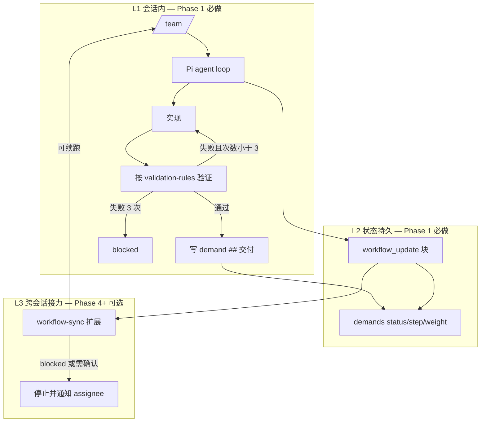
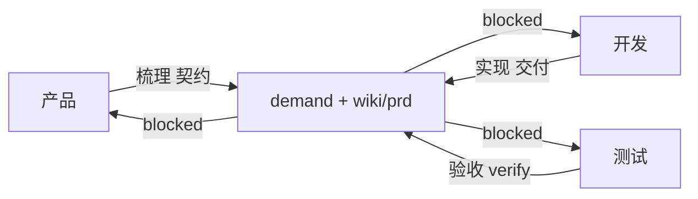

# pi-agent 企业研发自动化工作区设计方案 v5

> **状态**：最终建议版 v5  
> **后续修订**：已被 `docs/pi-agent-design-v5.1.md` 根据 `/team` 实测结果修订；当前权威版见 `docs/pi-agent-design.md`  
> **来源**：综合 v3 的系统性/自动化设计与 v4 的目标驱动/极简用户心智  
> **范围**：pi-agent 如何用 Pi / Pi.app 服务中小型企业 IT 产品研发团队；业务仓库内部架构不在本文范围内

---

## 0. v3 / v4 评审结论

### v3 优点

- 系统性强：覆盖知识、任务、执行、个人、质量、运维闭环。
- 自动化意识强：`workflow_update`、`gate-checker`、`workflow-sync`、`blocked digest`、环境脚本登记都能减少人工记流程。
- 边界清楚：生产发布、删数、生产库变更等高风险操作必须人工确认。
- 适合长期演进：能支撑 Pi.app 后续工作台、看板、审批、提醒。

### v3 问题

- 机制过多：work-item、PRD、spec、exec-spec、workflow-sync、gate-checker、phase、subagent 同时出现，首版落地负担偏重。
- 用户心智复杂：即使隐藏部分角色，文档读起来仍像在实现轻量 Jira + workflow engine。
- 自动链式风险高：多阶段自动跑容易黑盒化，失败时难复盘。

### v4 优点

- 目标驱动：G1-G6 清楚，所有机制都围绕目标取舍。
- 用户极简：一个 `/team` 命令、三态、四步、一个 demand 文件，非常适合新人上手。
- 轻重分级好：`weight: light|standard|strict` 比 Fast/Full 更直观。
- 降低首版成本：暂缓 workflow-sync、gate-checker、work-items 等重机制。

### v4 问题

- 把 PRD、work-item、exec-spec 都合并到 `demands/`，对企业知识库治理偏弱。
- 不完全满足最初目标中“wiki 包含 PRD、页面原型、数据字典、数据库、代码仓库索引”的要求。
- 对测试环境、运维、Pi.app 工作台的系统闭环表达不足。
- “一条需求一个文件”适合交付卷宗，但不适合承载长期可复用知识。

### v5 取舍

v5 采用：

- **用户面采用 v4**：一个 `/team`、三态、四步、`weight` 分级。
- **系统面采用 v3 精华**：MECE 分层、知识闭环、自动化 handoff、运维登记、JTBD、后续 Pi.app 看板。
- **产物模型折中**：`demands/` 是团队工作项和交付卷宗；`wiki/` 是长期知识库。PRD、原型、数据字典、接口、环境说明仍属于 `wiki/`，不被 demand 文件吞掉。

一句话：

> **一个命令驱动交付；一个 demand 追踪任务；一个 wiki 承载知识；一个 JTBD 管个人待办；自动化默认推进，但高风险必须停下找人。**

---

## 1. North Star

pi-agent 面向中小型企业 IT 产品研发团队，目标是用 Pi / Pi.app 连接产品、开发、测试、运维，实现：

| ID | 目标 | 成功表现 |
|---|---|---|
| G1 交付效率 | 需求更快变成可运行、可验证的改动 | 用户说清意图后，AI 能完成代码、验证和交付结论 |
| G2 可追溯 | 事后能查依据、改动、验证和风险 | 一个月后能从文件复盘，不依赖聊天记录 |
| G3 团队协同 | 每个人能看自己和他人的任务状态 | 站会能看 demand / JTBD / blocked digest |
| G4 少打扰 | 不要求成员记复杂流程和角色 | 默认只记 `/team` 和三态 |
| G5 守底线 | 不可逆和高风险动作必须人工确认 | 系统停下并写清找谁、确认什么 |
| G6 轻量演进 | 小需求轻，大需求重 | typo 不写 PRD，跨仓/权限/金额需求自动升格 |

---

## 2. Core Model

### 2.1 用户只面对四件事

| 对象 | 用户理解 | 路径 |
|---|---|---|
| 命令 | 用 `/team` 提需求、续跑、查看当前任务 | `.pi/prompts/team.md` |
| 需求卷宗 | 每条团队工作项的状态和交付记录 | `demands/D-YYYY-NNN-*.md` |
| 知识库 | 项目、PRD、数据库、原型、规范、环境 | `wiki/` |
| 个人待办 | 每个人自己的跟进项 | `JTBD/<user>-jtbd.md` |

### 2.2 三态 + 四步

frontmatter 用英文枚举，Pi.app 可显示中文。

| status | 中文显示 | 用户理解 |
|---|---|---|
| `active` | 进行中 | AI 或负责人正在处理 |
| `blocked` | 待确认 | 需要某个人确认或处理 |
| `done` | 完成 | 已交付、取消或归档 |

`step` 只用于展示当前阶段：

```text
clarify -> build -> verify -> release
梳理 -> 实现 -> 验收 -> 发布
```

取消不单设第四态，使用：

```yaml
status: done
outcome: cancelled
```

### 2.3 weight 分级

| weight | 场景 | 必需产物 |
|---|---|---|
| `light` | 单仓、小改、低风险 | demand 的意图 + 交付记录 |
| `standard` | 前后端联动、中等需求、需要 AC | demand + 契约章节，可选 wiki PRD |
| `strict` | 权限、金额、库存、财务、跨仓、数据库、测试环境/发版 | demand + wiki PRD + AC + 风险 + 验收/运维/审计记录 |

升格规则由 `/team` 判断，首版可由 agent 判断并写明原因，后续再沉淀为 `gate-checker.sh`。

---

## 3. MECE Information Architecture

### 3.1 四层分工

| 层 | 路径 | 职责 | 是否长期知识 |
|---|---|---|---|
| 知识层 | `wiki/` | 项目地图、PRD、原型、数据库、数据字典、接口、环境、制度 | 是 |
| 工作项层 | `demands/` | 团队任务状态、交付卷宗、阻塞找人、批准记录 | 否，随任务归档 |
| 执行层 | demand 的 `## 交付` / 可选 `wiki/exec-specs/` | 代码改动、验证、AC 覆盖、阻断项 | 半长期 |
| 个人层 | `JTBD/` | 每个人自己的待办和跟进 | 否，个人行动层 |

### 3.2 为什么不把所有内容放进 demands

`demands/` 记录“一件事的生命周期”，但不承载长期复用知识。

例如：

- 页面原型、正式 PRD、数据字典、接口契约属于 `wiki/`。
- 该需求当前谁负责、卡在哪里、验了什么属于 `demands/`。
- 个人今天要跟进什么属于 `JTBD/`。

这样符合 MECE：知识、任务、执行、个人行动互不重叠。

---

## 4. Workspace Structure

```text
pi-agent/
├── workspace.config.yaml
├── .pi/
│   ├── agents/
│   │   └── team.md
│   ├── prompts/
│   │   └── team.md
│   ├── extensions/
│   │   ├── subagent/
│   │   └── jtbd-sync/
│   └── skills/
│       ├── shared-prd-template/
│       ├── shared-ac-patterns/
│       ├── pm-dor-checker/
│       ├── shared-handoff-builder/
│       ├── qa-checklist/
│       └── ship-checklist/
├── wiki/
│   ├── agent-reading-map.md
│   ├── project-overview.md
│   ├── project-map.md
│   ├── workflow-usage.md
│   ├── validation-rules.md
│   ├── prd/
│   ├── prototypes/
│   ├── exec-specs/
│   ├── adr/
│   ├── api-contracts/
│   ├── data-dictionary/
│   ├── raw/database/
│   ├── environments.md
│   └── runbooks/
├── demands/
│   ├── template.md
│   └── D-YYYY-NNN-*.md
├── JTBD/
│   ├── index.md
│   └── <git-user>-jtbd.md
├── scripts/
│   ├── bootstrap-workspace.sh
│   ├── setup-pi-entrypoints.sh
│   ├── check-pi-env.sh
│   ├── sync-wiki.sh
│   ├── sync-jtbd-index.sh
│   ├── next-demand-id.sh
│   ├── validate-demand.sh
│   └── blocked-digest.sh
└── <business-repos>/
```

业务仓库是独立 Git 仓库，放在 pi-agent 工作区下，但由 pi-agent 总仓库 `.gitignore` 忽略。

---

## 5. pi / pi-app Responsibilities

| 组件 | 职责 | 首版优先级 |
|---|---|---|
| Pi | 执行 `/team`、读 wiki、写 demand、改代码、跑验证、调用 subagent/skill | P0 |
| Pi extensions | JTBD 自动同步、subagent、后续可加 workflow-sync | P0/P1 |
| Pi.app | 桌面入口；后续展示 demands、JTBD、wiki、待确认项 | P2 |

Pi.app 不成为源数据。它读取 Git 文件，最多追加批准记录或触发 `/team <id>` 续跑。

---

## 6. Demand File Protocol

### 6.1 路径

```text
demands/D-YYYY-NNN-简短标题.md
```

### 6.2 frontmatter

```yaml
---
id: D-2026-001
title: ""
weight: light|standard|strict
status: active|blocked|done
outcome: delivered|cancelled|duplicate|wont_do
step: clarify|build|verify|release
owner: ""
assignee: ""
project: ""
repos: []
risk: low|medium|high
prd_ref: ""
prototype_ref: ""
exec_spec_ref: ""
created_at: ""
updated_at: ""
---
```

### 6.3 正文章节

```markdown
## 意图

用户原始意图、澄清结论、业务背景。

## 契约

weight >= standard 时必填：范围、不做范围、AC、风险、关联 PRD/原型/接口/数据。

## 交付

实现摘要、改动仓库、验证命令、结果、AC 覆盖、未验证项、既有阻断。

## 阻塞

status=blocked 时必填：原因、找谁、要确认什么、如何续跑。

## 批准

人工批准记录：时间、批准人、事项。
```

### 6.4 阻塞协议

```markdown
## 阻塞

- 原因：
- 找谁：owner@company.com
- 你要做什么：
- 续做：/team D-2026-001
- 自：2026-06-16T10:00:00+08:00
- 已升级：false
```

规则：

- `找谁` 必须是真人，不写 agent 名。
- 阻塞超过配置时间后，`blocked-digest.sh` 输出站会清单。
- 可选：`jtbd-sync` 给 assignee 自动追加个人待办。

---

## 7. Knowledge System

`wiki/` 是长期知识库，必须可被人读，也能被 agent 路由读取。

### 7.1 agent-reading-map

`wiki/agent-reading-map.md` 是读取路由，定义：

- 不同任务类型必须读什么。
- 哪些文档按需读。
- 哪些大文件禁止全文读。
- 各类信息的 source of truth。

### 7.2 必备知识目录

| 路径 | 内容 |
|---|---|
| `wiki/project-overview.md` | 业务域、架构摘要、领域语言、高风险点 |
| `wiki/project-map.md` | 仓库、模块、负责人、常用命令、环境脚本 |
| `wiki/prd/` | 正式产品需求 |
| `wiki/prototypes/` | 页面原型、交互草图、流程图 |
| `wiki/api-contracts/` | 接口、错误码、权限 code |
| `wiki/data-dictionary/` | 数据字典、枚举、指标口径 |
| `wiki/raw/database/` | DDL 原始文件和表索引 |
| `wiki/environments.md` | 测试/预发/生产环境说明，可执行脚本登记 |
| `wiki/runbooks/` | 部署、回滚、故障处理 |
| `wiki/validation-rules.md` | 测试、lint、build、冒烟验证策略 |

### 7.3 wiki 维护规则

- 新增核心文档必须更新 `agent-reading-map.md`。
- 数据库大文件必须有索引，agent 禁止全文读取。
- PRD、原型、数据字典、接口契约是长期知识，不写进 demand 替代。
- demand 只引用 wiki 文件，不复制长期知识。

---

## 8. Workflow

### 8.1 唯一日常命令

```text
/team <意图或 D-2026-001>
```

行为：

1. 判断是新需求还是续跑已有 demand。
2. 读取 `agent-reading-map.md` 和最小必要 wiki。
3. 判断 `weight`。
4. 必要时创建或更新 demand。
5. 自动执行实现、验证、交付记录。
6. 高风险或歧义时进入 `blocked`。

角色分工与完整案例见 **§15 角色使用案例**（产品 / 开发 / 测试）。

### 8.2 内部能力，不暴露给普通用户

内部可用 subagent/skill：

- planner：生成 PRD/原型/AC。
- developer：实现代码和自测。
- qa：复核 AC、权限、金额、库存、状态流转等高风险。
- ops：执行已登记的测试环境/冒烟/回滚脚本。
- ship：发版前审计。

用户不需要记这些角色。

### 8.3 自动推进边界

默认不做后台多跳黑盒 auto-chain。

- 同一次 `/team` 可以完成 light/standard 的主要闭环。
- strict 任务在关键节点停下，提示 `/team D-xxx` 续跑。
- 生产发布、生产数据库变更、删数、未登记脚本必须人工批准。

### 8.4 无 goal/loop 的自动化模型

workflow 意义上的 `goal` / `loop`（跨会话外层调度 skill）**不是 v5 首版依赖**。自动化由三层叠加完成；每层可独立落地，不必一次上齐。

#### 8.4.1 三种「循环」勿混淆

| 名称 | 含义 | v5 策略 |
|---|---|---|
| **Pi agent loop** | 一次 `/team` 会话内：工具调用 → 改代码 → 跑验证 → 再改，直到本回合结束 | **默认启用**（Pi 运行时自带） |
| **workflow `loop`** | 项目级重复执行直到退出条件（如 test 全绿、DoR 全过） | **不引入**独立 skill；纪律写入 `team` prompt + `validation-rules.md` |
| **workflow `goal`** | 跨多任务/多会话的阶段性总目标 | **不引入**独立 skill；由 `demands/` 文件承载目标与进度 |

#### 8.4.2 三层自动化



**L1 会话内（真自动的主战场）**

- `team` agent 纪律：对 `light` / `standard`，同一次 `/team` 必须按 `wiki/validation-rules.md` 跑完最小验证，再写 `## 交付`；不得只留「建议人工测试」。
- 验证失败：会话内自动修复并重跑；**同一命令连续失败 3 次** → `status: blocked`，等价于 workflow `loop` 的安全退出。
- 需要多视角时（DoR、QA、Ship）：在同一会话内调 **skill / subagent**，用户仍只发 `/team`。

**L2 状态持久（goal 的替代）**

| workflow goal/loop 做的事 | v5 替代 |
|---|---|
| 可检查的完成条件 | demand `## 契约` AC + `weight` |
| 进度存在哪 | demand `status` / `step` / `## 交付` |
| 为何停下 | `## 阻塞` + `assignee` |
| 机器可读下一步 | `workflow_update`（§10） |

`demand` 即持久目标对象；**无需再叠一层 goal 文件**。

**L3 跨会话接力（可选，非首版默认）**

当 L1 结束但 `step` 未到 `done`、且未 `blocked` 时，由 **`workflow-sync` 扩展**（Phase 4+）读取 `workflow_update`，决定是否自动续跑同一 demand。

`workspace.config.yaml` 建议项：

```yaml
automation:
  auto_continue: false              # 默认关；团队成熟后可开
  max_hops_per_session: 2           # 同一会话自动续跑上限
  max_verify_retries: 3             # 同命令验证失败上限
  blocked_escalate_hours: 24
```

#### 8.4.3 workflow-sync 触发条件（Phase 4+）

`message_end` 解析 `workflow_update` 后：

| 条件 | 行为 |
|---|---|
| `human_confirmation_required: true` | **停止**；demand → `blocked`；写 `## 阻塞`；可选 JTBD 通知 assignee |
| `blocking_reason` 非空 | **停止** |
| `status: done` | **停止** |
| 验证失败次数 ≥ `max_verify_retries` | **停止** → `blocked` |
| 本会话已自动续跑 ≥ `max_hops_per_session` | **停止**；回复「已完成 X，请 `/team D-xxx` 继续」 |
| `auto_continue: false` | **停止**；仅更新 demand，不 spawn 下一跳 |
| 以上皆否，且 `next_action` / `step` 表明可继续 | **spawn** 同一 `team`（或指定 subagent）处理同一 `demand` |

**始终停止、不自动续跑**（即使 `auto_continue: true`）：

- 生产部署、生产库变更、删数
- 执行未在 `wiki/environments.md` / `runbooks` 登记的脚本
- `weight: strict` 且 `step` 从 `verify` → `release`（须显式 `/team D-xxx` 或 `## 批准`）

#### 8.4.4 与 goal/loop 的功能对照

| 场景 | 不用 goal/loop 时谁负责 |
|---|---|
| PRD / DoR 反复检查 | 会话内 `pm-dor-checker`；不通过则 `blocked` 回产品 |
| test/lint/build 收敛 | **Pi agent loop** + 3 次上限 |
| PM 澄清 → 开发实现 | 同会话 subagent；或 demand `step: clarify` → `build` 后 `/team D-xxx` |
| 开发完成 → 测试验收 | `strict`：`step: verify` + `/team 验收 D-xxx`；或 L3 自动续跑（可选） |
| 站会看卡住的项 | `blocked-digest.sh` + `JTBD/index.md`（非 goal 看板） |

#### 8.4.5 实施顺序（写入 Phase 规划）

| 阶段 | 自动化能力 | 依赖 goal/loop？ |
|---|---|---|
| Phase 1 | L1 + L2：`/team` 会话闭环 + demand + `workflow_update` | 否 |
| Phase 2 | L1 加强：validation-rules、DoR/QA/Ship skills | 否 |
| Phase 4 | L3：`workflow-sync` + `auto_continue`（默认仍 false） | 否 |
| Phase 5 | Pi.app「继续执行」→ 写 `## 批准` 或触发 `/team D-xxx` | 否 |

**结论**：v5 的「真自动」= **会话内 Pi agent loop 做完实现与验证** + **demand 持久化进度**；跨会话无人值守是 **可选增强**，不靠 goal/loop skill，靠 `workflow_update` + `workflow-sync` + 明确停止条件。

---

## 9. Quality and Ops Gates

### 9.1 DoR

正式 PRD 必须满足：

- 背景和业务问题清楚。
- 目标与不做范围明确。
- 适用项目明确。
- 用户角色和权限规则明确。
- 主流程、异常流程、边界条件明确。
- 页面入口、核心操作、交互状态明确。
- 字段、校验、数据来源明确。
- 接口/表/字典/权限 code 明确或标注待确认。
- AC 编号化且可测试。
- 风险、发布注意事项、回滚方向明确。

### 9.2 DoD

demand 完成前必须记录：

- 实现摘要。
- 影响仓库和关键文件。
- 验证命令。
- 验证结果。
- 未验证项。
- 既有阻断。
- 是否需要 QA / Ops / Ship。

### 9.3 QA 触发

以下场景必须触发 QA 或至少生成 QA 清单：

- shared/公共模块。
- 权限、角色、登录态。
- 金额、订单、库存、财务、物流关键流程。
- 数据库 Schema。
- 跨仓库改动。
- BI/报表指标口径。

### 9.4 Ops 触发

以下场景必须进入 Ops 检查：

- 需要部署测试环境。
- 需要冒烟验证。
- 修改环境变量或配置。
- 涉及回滚方案。
- 需要执行环境脚本。

Ops 只能执行 `wiki/environments.md` 或 `wiki/runbooks/` 中登记的脚本。

### 9.5 Ship 审计

准备合并主分支、发版或上线前，必须检查：

- git diff 是否符合 demand / PRD 范围。
- 测试、lint、build、package 是否充分。
- 是否涉及数据库迁移。
- 是否涉及环境变量。
- 是否有破坏性 API。
- 是否有回滚方案。
- 是否存在未验证项。

---

## 10. Automation Protocol

agent 最终输出应包含结构化块，供后续扩展或人工读取：

```yaml
workflow_update:
  demand: D-2026-001
  status: active|blocked|done
  step: clarify|build|verify|release
  weight: light|standard|strict
  owner: ""
  assignee: ""
  handoff: ""
  blocking_reason: ""
  verification:
    scope: targeted|module|full|env-dependent
    commands: []
    result: pass|fail|partial|not_run
  next_action: ""
  human_confirmation_required: true|false
```

首版可以由 `/team` agent 按此块更新 demand；后续可由 `workflow-sync` 扩展解析并自动写入。

### 人工确认规则

`human_confirmation_required: true` 时：

- demand 必须 `status: blocked`。
- `## 阻塞` 必须写清找谁和要确认什么。
- agent 不得继续执行高风险操作。

---

## 11. Personal JTBD

`JTBD/` 服务个人协同，不替代 demand。

```text
JTBD/
├── index.md
├── alice-jtbd.md
└── bob-jtbd.md
```

规则：

- 每个人只维护自己的 JTBD。
- agent 每次结束时评估是否通过 `[JTBD-UPDATE]` 更新。
- `JTBD/index.md` 由脚本汇总，供站会查看。
- demand blocked 且 assignee 是某人时，可自动给该人 JTBD 增加待办。

---

## 12. pi-app Evolution

Pi.app 不改变源数据，只读取文件协议。

阶段：

1. 打开 pi-agent 工作区，提供 `/team` 执行入口。
2. 展示 `demands/` 列表：进行中、待确认、完成。
3. 展示 `JTBD/index.md` 和个人 JTBD。
4. 展示 wiki 搜索、PRD、原型、数据字典、接口契约。
5. 对 `blocked` demand 提供“批准/补充说明/继续执行”入口，写入 `## 批准`，再触发 `/team D-xxx`。

---

## 13. Implementation Phases

| 阶段 | 目标 | 交付物 | 验收 |
|---|---|---|---|
| Phase 1 | 跑通单命令交付 | `team` agent、`/team` prompt、`demands/template.md`、基础 wiki | 一个 light 需求闭环 |
| Phase 2 | 建立知识与契约 | `agent-reading-map.md`、PRD 模板、AC/DoR skills、validation-rules | 一个 standard 需求 AC 可追溯 |
| Phase 3 | 建立阻塞与个人协同 | JTBD、blocked-digest、`## 阻塞` 协议 | 人为制造歧义，assignee 获得待办 |
| Phase 4 | 建立质量和运维门禁 | QA/Ops/Ship 清单、environments/runbooks | 一个 strict 需求完整审计 |
| Phase 4+ | 可选跨会话接力（§8.4 L3） | `workflow-sync`、`auto_continue` 配置（默认 false） | 给定 `workflow_update` 正确续跑或正确停止 |
| Phase 5 | Pi.app 工作台 | demand 列表、待确认、JTBD、wiki 浏览、「继续执行」 | 文件状态与 UI 一致 |

---

## 14. Test Plan

| 样本 | weight | 验证目标 |
|---|---|---|
| 文案/样式小改 | light | `/team` 一条命令完成交付 |
| 前后端字段联动 | standard | demand 契约 + AC + 验证记录 |
| 权限/订单/库存/财务需求 | strict | 触发 QA，阻塞时写清找谁 |
| 测试环境部署/回滚演练 | strict | Ops 只执行登记脚本 |

成功标准：

- 新人只需知道 `/team`、三态、demand 文件即可开始。
- 任意 demand 文件可独立复盘。
- 所有 `blocked` 都有真人 assignee 和下一步动作。
- wiki 中 PRD、原型、数据字典、接口、数据库等长期知识不被 demand 吞掉。
- 小需求不被强制 PRD 化，大需求可以完整追溯。

---

## 15. 角色使用案例

v5 不要求成员记忆不同 agent 或命令。**产品、开发、测试日常都用 `/team`**，差异在于：谁发起、在什么 `step` 介入、读写哪些文件。

### 15.1 共用约定

| 项 | 全员相同 |
|---|---|
| 日常命令 | `/team <意图或 D-编号>` |
| 看团队任务 | 打开 `demands/`，或 pi-app 需求列表（后续） |
| 看个人待办 | `/jtbd-show` 或 `JTBD/<自己>-jtbd.md` |
| 站会扫阻塞 | `scripts/blocked-digest.sh` 或 `JTBD/index.md` |
| 状态语言 | 进行中 / 待确认 / 完成（三态） |

角色差异体现在 **demand 的 `owner` / `assignee`、`step`、以及是否写 wiki 长期知识**，而不是换一套工具。



---

### 15.2 产品经理

#### 职责边界（在 pi-agent 内）

| 做 | 不做 |
|---|---|
| 澄清需求、写/改 PRD 与原型说明 | 改业务仓库代码 |
| 维护 `## 意图`、`## 契约` 与 AC | 代替开发填完整 `## 交付` |
| 对歧义、业务规则拍板（`## 批准`） | 执行测试环境脚本、生产发布 |

#### 典型场景

**场景 A：新功能（standard / strict）**

```text
/team 采购单列表需要批量审核，最多 50 单，仅采购主管可用
```

agent 预期行为：

1. 创建 `demands/D-2026-00x-采购单批量审核.md`，`owner` 为产品同学。
2. `weight` 判为 `standard` 或 `strict`（含权限 → 倾向 strict）。
3. 在 `## 意图` 记录原话与澄清问题；信息不足则 `status: blocked`，`找谁` 为产品自己或业务方。
4. 满足 DoR 后：
   - 在 demand `## 契约` 写 AC、不做范围、风险；
   - 在 `wiki/prd/<域>/REQ-....md` 写正式 PRD（strict 必填）；
   - 可选在 `wiki/prototypes/` 补交互说明；
   - demand frontmatter 填 `prd_ref`、`prototype_ref`。
5. `step: clarify` → 契约就绪后改为 `build`，`assignee` 交给研发 `owner`（或保持产品 owner、研发在交付节署名）。

产品同学续跑澄清：

```text
/team D-2026-00x
```

补充业务答案后，agent 更新契约与 PRD，直至 DoR 通过。

**场景 B：小改动（light）——产品只把关意图**

```text
/team 把订单列表「待发货」改成「待出库」，只改文案
```

通常 `weight: light`，**不必建 wiki PRD**。产品若需留痕，可在 demand `## 意图` 写清原文；实现与验证由 agent 在 `## 交付` 一次记完。产品仅在结果不符合预期时：

```text
/team D-2026-00x 文案不对，应为「待出库（WMS）」
```

**场景 C：被阻塞时（产品拍板）**

demand 出现：

```markdown
## 阻塞
- 原因：取消单是否可回滚，PRD 与业务口径不一致
- 找谁：lisi@company.com
- 你要做什么：确认 AC-003 取消后库存是否回滚
- 续做：/team D-2026-00x
```

产品确认后，在同一文件追加 `## 批准`，再 `/team D-2026-00x` 续跑。

#### 产品主要读写

| 读 | 写 |
|---|---|
| `wiki/project-overview.md`、`wiki/prd/README.md` | `wiki/prd/**`、`wiki/prototypes/**` |
| 相关 demand | demand `## 意图`、`## 契约`、`## 批准` |
| `agent-reading-map.md`（由 agent 代读） | 不直接改业务仓 |

---

### 15.3 开发（全栈 / 前后端）

#### 职责边界

| 做 | 不做 |
|---|---|
| 实现代码、跑验证、写 `## 交付` | 擅自改 PRD 业务规则（应 blocked 回产品） |
| 判断 `weight` 是否需升格 | 跳过 strict 的 QA/Ops 门禁 |
| 续跑 `step: build` 的 demand | 执行未登记环境脚本、生产发布 |

#### 典型场景

**场景 A：接产品已梳理需求（最常见）**

```text
/team D-2026-00x
```

或口头：

```text
/team 按 D-2026-00x 实现批量审核
```

agent 预期行为：

1. 读 demand `## 契约` + `prd_ref` 指向的 wiki PRD。
2. 按 `agent-reading-map.md` 读 `project-map`、`validation-rules`、相关规范。
3. 改 `repos` 中业务仓，更新 demand `step: build`。
4. 在 `## 交付` 填：改动文件、验证命令、AC 覆盖表。
5. 若 `weight: strict` 且命中 QA 规则（如权限）→ `step: verify`，在交付节注明「待验收」或触发内部 qa-checklist，**不要求开发另开命令**。
6. 验证失败 3 次 → `status: blocked`，`找谁` 为开发 owner。

**场景 B：开发自发小需求（light）**

```text
/team 修复业务端订单列表分页 off-by-one，单测已能复现
```

无产品时也可闭环：`weight: light`，demand `owner` 为开发本人；`## 意图` + `## 交付` 即可，无需 wiki PRD。

**场景 C：实现中发现契约缺口**

开发不应静默假设，应写阻塞：

```text
/team D-2026-00x 契约未定义超过 50 单时的错误码，无法继续实现
```

agent 将 demand 置 `blocked`，`找谁` 指向产品或 demand `owner`，`step` 保持 `build`。

**场景 D：准备合入 / 发版（strict）**

```text
/team D-2026-00x 做发版前检查
```

`step: release`，使用 ship-checklist skill，结果写入 `## 交付`；涉及生产 → `blocked` + `## 批准`，等人确认后再发布（人工操作，agent 不代发）。

#### 开发主要读写

| 读 | 写 |
|---|---|
| demand、`wiki/validation-rules.md` | 业务仓库代码 |
| `prd_ref`、`api-contracts/`、`raw/database/table-index.md` | demand `## 交付`、`## 阻塞` |
| `agent-reading-map.md` 路由的规范 | 高风险时可写 `wiki/exec-specs/`（引用进 `exec_spec_ref`） |

---

### 15.4 测试

#### 职责边界

| 做 | 不做 |
|---|---|
| 对照 AC/PRD 验收、补验收记录 | 日常参与每个 light 需求 |
| 对 strict / 高风险 demand 做 verify | 改需求契约（应 blocked 回产品） |
| 提出阻塞（复现步骤、预期/实际） | 代替开发修代码（可另开 `/team` 修，但角色上属开发闭环） |

#### 何时介入

| weight | 测试是否必须介入 |
|---|---|
| `light` | 否，开发自测 + 交付节即可 |
| `standard` | 按需；涉及接口联动、多仓时建议介入 |
| `strict` | **必须**；权限/金额/订单/库存等按 §9.3 执行 |

#### 典型场景

**场景 A：验收 strict 需求（主路径）**

产品+开发完成后，demand 处于 `step: verify` 或交付节标注「待验收」。

测试同学：

```text
/team 验收 D-2026-00x，对照 PRD 与 AC 逐条检查
```

agent 预期行为：

1. 读 demand `## 契约`、AC 列表及 `prd_ref`。
2. 读 `## 交付` 中开发声称的覆盖与验证结果。
3. 按 qa-checklist skill 执行：用例对照、风险路径、权限/状态/金额等。
4. 在 `## 交付` 追加 **验收记录** 小节，例如：

```markdown
### 验收记录（测试）

| AC | 结果 | 说明 |
|---|---|---|
| AC-001 | pass | 主管可见入口 |
| AC-002 | pass | 非主管无入口 |
| AC-003 | fail | 第 51 单未提示，见截图路径 |

验收结论：blocked
```

5. `status: blocked` 时 `找谁` 为开发 owner；`jtbd-sync` 可给开发加 JTBD。
6. 全部 pass → `step` 可进入 `release` 或 `status: done`（视是否还要 Ops/Ship）。

**场景 B：独立复核他人改动（不信任 dev 自测时）**

```text
/team 独立验收采购单批量审核相关改动，prd_ref 见 demand D-2026-00x
```

不依赖开发摘要，测试自行对照 diff + AC + PRD。

**场景 C：测试环境 / 冒烟（strict + Ops）**

```text
/team D-2026-00x 在测试环境冒烟
```

仅当 `wiki/environments.md` 或 `runbooks` 有登记脚本；结果写入 `## 交付` 的环境验证段。脚本未登记 → `blocked`，`找谁` 运维或模块负责人。

**场景 D：产品规则疑问（测试提阻塞）**

```text
/team D-2026-00x AC-002 与现网角色配置矛盾，请产品确认
```

`找谁` 指向产品；`step` 保持 `verify` 或回 `clarify`。

#### 测试主要读写

| 读 | 写 |
|---|---|
| demand `## 契约`、`## 交付` | demand `## 交付` 内验收记录 |
| `wiki/prd/`、`validation-rules.md` | `## 阻塞`（失败/歧义时） |
| 业务仓 diff（由 agent 代查） | 一般不写 wiki PRD、不改契约 AC |

---

### 15.5 三角色协作时间线（strict 需求示例）

以「采购单批量审核」为例：

| 顺序 | 角色 | 动作 | demand 状态 |
|---|---|---|---|
| 1 | 产品 | `/team 采购单批量审核…` | `active` / clarify |
| 2 | 产品 | 回答澄清，`/team D-001` 续跑 | `active` / clarify → 契约就绪 |
| 3 | 系统 | PRD 写入 wiki，`step` → build | `active` / build |
| 4 | 开发 | `/team D-001` 实现+验证 | `active` / build |
| 5 | 系统 | 命中权限风险，`step` → verify | `active` / verify |
| 6 | 测试 | `/team 验收 D-001` | `active` / verify |
| 7 | 测试 | AC-003 fail → blocked | `blocked`，找谁=开发 |
| 8 | 开发 | 修复，`/team D-001` | `active` / verify |
| 9 | 测试 | 复验 pass | `active` / release |
| 10 | 开发 | `/team D-001 发版前检查` | release 审计 |
| 11 | 负责人 | `## 批准` 生产发布（人工） | 人工发布后 `done` |

全程 **无人需要切换 `/team-qa` 或 `/team-pm` 命令**；角色体现在 `owner`、`assignee` 与谁执行哪一步 `/team`。

---

### 15.6 角色与文件对照（速查）

| 角色 | 首选命令 | 常写目录/章节 | 关注三态 |
|---|---|---|---|
| 产品 | `/team <新意图>`、`/team D-xxx` 澄清 | `wiki/prd/`、`## 意图` `## 契约` `## 批准` | 待确认且找谁=自己 |
| 开发 | `/team D-xxx`、自发 light 需求 | 业务仓、`## 交付` `## 阻塞` | 待确认且找谁=自己 |
| 测试 | `/team 验收 D-xxx` | `## 交付` 验收记录、`## 阻塞` | 待确认且找谁=开发/产品 |

---

### 15.7 培训要点（给负责人 10 分钟 onboarding）

对产品：

- 你负责把需求说清楚；大单会生成 PRD 到 `wiki/prd/`，任务进度在 `demands/`。
- 被 `找谁` 点名时，改 `## 批准` 或回复澄清，再 `/team D-xxx`。

对开发：

- 接到需求只看 demand + PRD 引用；实现完保证 `## 交付` 可复盘。
- 契约不清先 blocked，不要猜。

对测试：

- 只验收 `strict`（或约定的高风险）需求；一条命令 `/team 验收 D-xxx`。
- fail 写清 AC 与复现，blocked 找开发；业务规则问题找产品。

全员：

- **记不住流程时，只记 `/team` 和你的 demand 编号。**

---

## 16. Assumptions and Non-goals

### Assumptions

- 团队以中小规模、全栈交付为主。
- 多数需求可以由一个技术开发智能体闭环，QA/Ops/Ship 按风险触发。
- 业务仓库自有 CI，pi-agent 记录验证和提前发现问题，不替代业务仓 CI。
- Git 文件协议优先，后续 Pi.app 读取同一套协议做可视化。

### Non-goals

- 不做 Jira 替代。
- 不做数据库型项目管理系统首版。
- 不暴露六个用户可见 agent 角色。
- 不默认后台多跳 auto-chain。
- 不自动生产发布。
- 不自动生产数据库变更。
