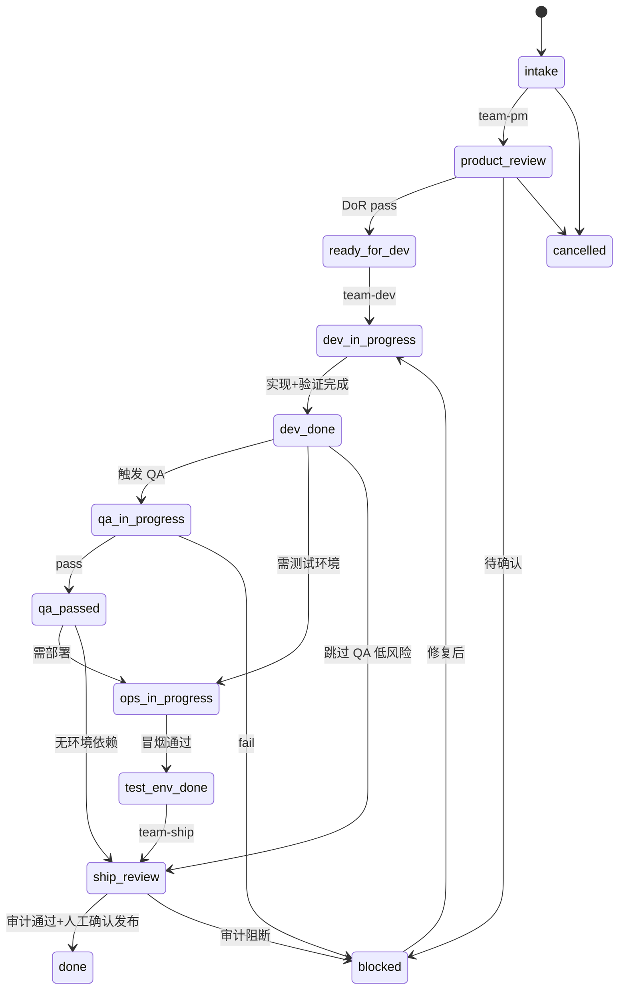

# pi-agent 企业研发自动化工作区设计方案

> **状态**：草案 v2（待 Phase 1 落地验证）
> **参考落地**：`../mk-lab`（`mk-erp-wiki`、`.pi/agents`、JTBD 扩展已验证）
> **关联文档**：[`docs/product-team-agent-plan.md`](docs/product-team-agent-plan.md)（角色精简视角）、[`AGENTS.md`](AGENTS.md)（工作区维护约定）

## Summary

pi-agent 面向中小型企业 IT 产品研发团队，目标是把 Pi / Pi.app 作为 AI 开发与协同工具，连接产品、开发、测试、运维，形成可版本化、可追溯、可自动化推进的软件研发工作流。

第一版**不建数据库型项目管理系统**，采用**文件协议优先**：业务仓库、企业知识库、团队工作项、PRD、执行规格、个人 JTBD、智能体配置都在同一工作区内用 Git 管理。Pi 负责 agent 执行与自动化编排；Pi.app 逐步承接团队工作台、知识库检索和任务看板可视化，但**不替代文件源数据**。

核心闭环：

| 层 | 目录 | 权威职责 |
|---|---|---|
| 知识 | `wiki/` | 长期有效组织知识；PRD 是产品-研发契约 |
| 团队任务 | `work-items/` | 团队可见状态、负责人、下一 agent、阻断原因 |
| 执行追溯 | `wiki/exec-specs/` | 中大需求的实现、验证、风险追溯 |
| 个人待办 | `JTBD/` | 每人自己的跟进项，全员可见、本人维护 |

关键机制：

- **agent-reading-map** 管理知识读取路由，避免智能体把 wiki 全量塞进上下文。
- **workflow_update + handoff 协议** 让 `team-flow` 可自动推进，但在生产发布、生产库变更、大范围重构等高风险节点停下等待人工确认。
- **JTBD 自动同步** 通过 `jtbd-sync` 扩展解析 `[JTBD-UPDATE]` 块，零人工维护个人待办。

### 与 product-team-agent-plan 的关系

[`product-team-agent-plan.md`](docs/product-team-agent-plan.md) 从**角色数量**出发，建议默认一个强全栈开发智能体 + 按需 QA/Ship。本方案从**工作区协议**出发，保留 PM / Dev / QA / Ops / Ship / Flow 六类入口，但：

- 小团队可把 `/team-dev` 作为默认主力，`/team-pm` 仅在需要正式 PRD 时启用。
- `/team-qa`、`/team-ship` 仍按影响半径按需触发，不进入每个需求的默认链路。
- 两套文档不冲突：前者定「谁来做」，本方案定「写什么文件、状态怎么流转」。

## System Principles

### MECE 分层

四层互斥且完整，**禁止同一事实在多处各写一套状态**：

1. **知识层** `wiki/`：PRD、ADR、接口契约、环境说明等长期知识。
2. **工作项层** `work-items/`：团队任务视图的唯一状态源（`status`、`owner`、`current_agent`）。
3. **执行层** `wiki/exec-specs/`：实现过程追溯；不承载团队任务状态。
4. **个人层** `JTBD/`：个人待办；与 work-item 关联但不替代团队状态。

### 状态权威来源（Single Source of Truth）

| 问题 | 权威来源 | 其他文件如何处理 |
|---|---|---|
| 需求能否交给开发？ | PRD `ready_for_dev` + DoR 检查结果 | work-item 引用 PRD，不重复维护 DoR |
| 团队当前做到哪一步？ | work-item `status` | PRD `status` 只反映产品契约生命周期 |
| 代码改动了什么、验了什么？ | exec-spec Traceability | work-item 只摘要最新验证结果 |
| 张三今天该做什么？ | `JTBD/<user>-jtbd.md` | 可引用 work-item id，但不写团队状态 |

**同步规则**：

- PRD 进入 `ready` 时，关联 work-item 才可进入 `ready_for_dev`。
- work-item 进入 `dev_done` 时，PRD 可更新为 `implemented`（由 dev agent 或 team-flow 写入）。
- work-item 进入 `done` 时，PRD 更新为 `shipped`；exec-spec 归档引用保留。

### 五个闭环

- **初始化**：clone 业务仓库 → 生成 `.pi` 入口 → 环境检查 → wiki 索引同步。
- **知识**：PRD / ADR / 接口 / 项目地图变更时，更新 `agent-reading-map` 与相关索引。
- **任务**：work-item → PRD → dev_task → exec-spec → QA/Ops/Ship → 完成或归档。
- **质量**：DoR、DoD、QA、Ops、Ship 各有结构化门禁与产物。
- **运维**：测试环境部署、冒烟、回滚命令必须登记在 `wiki/environments/` 或 `wiki/runbooks/`。

### 自动化协同原则

- **默认最大自动化**：读 wiki、写 PRD、写代码、跑测试、修失败、同步索引、更新 JTBD、推进 work-item。
- **高风险必停**：生产部署、生产库变更、删数据、大范围重构、跨仓库扩 scope、未登记环境脚本、不可逆操作。
- **每次推进留 handoff**：当前状态、下一 agent、输入输出、阻断原因、验证结果。
- **失败不静默**：写入 work-item、exec-spec 或最终报告，禁止跳过。

### 非目标（第一版不做）

- 数据库型任务系统、Jira/Linear 替代。
- 自动 `git commit` / `git push`（除非用户明确要求）。
- Pi.app 内嵌编辑器替代 Git 文件源。
- 生产环境自动部署或自动数据库迁移。
- 按部门硬拆 wiki 顶层目录（用索引页代替）。

## Workspace Structure

```text
pi-agent/
├── .pi/
│   ├── agents/              # team-pm / team-dev / team-qa / team-ops / team-ship / team-flow
│   ├── prompts/             # /team-pm /team-dev /team-qa /team-ops /team-ship /team-flow /jtbd-show
│   ├── extensions/
│   │   ├── subagent/        # 子 agent 编排
│   │   └── jtbd-sync/       # [JTBD-UPDATE] 自动同步（复用 mk-lab 实现）
│   └── skills/              # PRD / AC / DoR / handoff / ADR / traceability
├── wiki/
│   ├── agent-reading-map.md # 智能体读取路由（必读维护）
│   ├── project-overview.md  # 业务、架构、领域语言、高风险点
│   ├── project-map.md       # 仓库、模块、技术栈、命令、负责人
│   ├── prd/
│   │   ├── README.md
│   │   ├── template.md
│   │   └── <domain>/REQ-YYYY-NNN-<slug>.md
│   ├── prototypes/
│   ├── exec-specs/
│   │   ├── template.md
│   │   └── REQ-YYYY-NNN-<slug>.md   # 与 PRD id 对齐
│   ├── adr/
│   ├── api-contracts/
│   ├── data-dictionary/
│   ├── raw/database/        # DDL 原始参考；禁止 agent 全文读取
│   ├── environments/          # 测试/预发/生产环境说明 + 登记脚本路径
│   ├── runbooks/
│   └── validation-rules.md
├── work-items/
│   ├── template.md
│   ├── REQ-YYYY-NNN.md
│   ├── BUG-YYYY-NNN.md
│   └── OPS-YYYY-NNN.md
├── JTBD/
│   ├── index.md               # 脚本生成：每人活跃项摘要
│   └── <git-user>-jtbd.md
├── scripts/
│   ├── bootstrap-workspace.sh   # 初始化目录骨架 + 业务仓库 clone 清单
│   ├── setup-pi-entrypoints.sh  # 同步 .pi 入口到 Pi 可发现路径
│   ├── check-pi-env.sh          # pi / pi-app / 业务仓库环境检查
│   ├── sync-wiki.sh             # 重建 wiki 索引（JTBD/index、表索引等）
│   └── sync-jtbd-index.sh       # 从各 *-jtbd.md 生成 JTBD/index.md
└── <business-repos>/            # 独立 Git 仓库，总仓库 .gitignore 忽略
```

业务源码由各业务仓库管理；pi-agent 总仓库只追踪团队配置、知识库、工作项和脚本。

## pi / pi-app 职责

| 组件 | 职责 | 不做什么 |
|---|---|---|
| **pi** | agent runtime、工具调用、subagent、读写文件、跑命令、验证、自动化推进 | Web 看板、产品化 UI |
| **pi-app** | 团队工作台可视化；读取同一套文件协议展示 PRD / work-items / JTBD / exec-spec / 报告 | 替代 Git 源数据、重新实现 agent runtime |

Phase 1–4 可在纯 pi CLI 完成；Phase 5 再让 pi-app 消费文件协议。

## Knowledge System

### agent-reading-map

智能体**必须先读** `wiki/agent-reading-map.md`，再按任务类型读取最小必要文档。结构参考 mk-lab：

- frontmatter：`scope`、`read_when`、`depends_on`
- **读取路由表**：任务类型 → 必读 / 按需读 / 禁止默认读
- **source of truth 表**：信息类型 → 权威文件
- **维护规则**：新增核心文档时必须补一行路由

大文件策略：

- `raw/database/*.sql` 只按 `table-index.md` + 表名检索，禁止全文读取。
- `archive/` 默认禁止 agent 读取。

### 角色入口（索引页，非顶层目录）

| 角色 | 入口索引 |
|---|---|
| 产品 | `wiki/prd/README.md`、原型、验收标准 |
| 研发 | `project-map.md`、`api-contracts/`、`validation-rules.md` |
| 测试 | `validation-rules.md`、缺陷规范、exec-spec 模板 |
| 运维 | `environments/`、`runbooks/` |

## Work Item Model

`work-items/` 解决「每人能管自己的任务，也能看到团队在做什么」。

### 类型与 ID

| type | 前缀 | 示例 |
|---|---|---|
| requirement | `REQ` | `REQ-2026-001` |
| bug | `BUG` | `BUG-2026-042` |
| ops | `OPS` | `OPS-2026-003` |

**ID 对齐**：需求类 work-item `id` 与 PRD `id`、exec-spec 文件名前缀一致（`REQ-2026-001`）。

### 状态机

状态分**主阶段**（必填）与**子状态**（可选写入 `status_detail`），避免 13 个平铺状态难以维护：



| status | 含义 | 典型 next_agent |
|---|---|---|
| `intake` | 刚创建，待澄清 | `team-pm` |
| `product_review` | PRD 编写/评审中 | `team-pm` |
| `ready_for_dev` | DoR 通过，待开发 | `team-dev` |
| `dev_in_progress` | 开发中 | `team-dev` |
| `dev_done` | 代码+验证完成 | `team-qa` / `team-ops` / `team-ship` |
| `qa_in_progress` | QA 验收中 | `team-qa` |
| `qa_passed` | QA 通过 | `team-ops` / `team-ship` |
| `ops_in_progress` | 测试环境操作中 | `team-ops` |
| `test_env_done` | 环境冒烟通过 | `team-ship` |
| `ship_review` | 发版审计中 | `team-ship` |
| `done` | 已交付 | — |
| `blocked` | 阻断，需人工 | 视 `blocking_reason` |
| `cancelled` | 取消 | — |

### frontmatter

```yaml
id: REQ-2026-001
title: ""
type: requirement|bug|ops
status: intake|product_review|ready_for_dev|dev_in_progress|dev_done|qa_in_progress|qa_passed|ops_in_progress|test_env_done|ship_review|done|blocked|cancelled
priority: P0|P1|P2|P3
project: ""
owner: ""
participants: []
prd_ref: ""              # wiki/prd/<domain>/REQ-2026-001-<slug>.md
exec_spec_ref: ""        # wiki/exec-specs/REQ-2026-001-<slug>.md
related_repos: []
current_agent: ""
next_agent: ""
automation_policy: auto_until_blocked|manual_gate|required_confirmation
blocking_reason: ""
created_at: ""
updated_at: ""
```

### 正文结构（template.md）

1. **背景** — 一两段业务上下文
2. **当前状态摘要** — 最近一次 handoff 的一句话结论
3. **关联材料** — PRD / 缺陷复现 / 运维目标链接
4. **dev_task** — 产品→研发交接块（见下节）
5. **Handoff 日志** — 按时间倒序，每条含 agent、输入、输出、验证
6. **最新验证结果** — 命令 + pass/fail + 范围
7. **下一步** — 明确动作与负责人

## PRD and Execution Contract

### PRD 路径

```text
wiki/prd/<domain>/REQ-YYYY-NNN-<slug>.md
```

### PRD frontmatter

```yaml
id: REQ-2026-001
title: ""
domain: ""
status: draft|review|ready|implemented|validated|shipped
ready_for_dev: false
affected_projects: []
modules_touched: []
risk: low|medium|high
owner: ""
adr_refs: []
work_item_ref: work-items/REQ-2026-001.md
created_at: ""
updated_at: ""
```

### PRD 状态与 DoR

| PRD status | 可交给开发 | 条件 |
|---|---|---|
| `draft` | 否 | 信息不完整 |
| `review` | 否 | 有待确认问题 |
| `ready` | 是 | DoR 全满足且 `ready_for_dev: true` |
| `implemented` | — | 研发完成 |
| `validated` | — | QA 通过 |
| `shipped` | — | 已上线 |

**Definition of Ready**（PRD 正文必含章节，DoR skill 自动检查）：

- 背景、目标、不做范围
- 适用项目与领域语言
- 用户角色与权限
- 主流程 / 异常 / 边界
- 页面入口与交互
- 接口 / 数据要求（或标注待研发确认）
- 编号化验收标准 `AC-001`…
- 风险与发布 / 回滚注意事项
- 待确认问题清单（为空才可 `ready`）

### dev_task（嵌入 work-item 正文）

产品到研发的 handoff，**不单独建文件**：

```yaml
dev_task:
  prd_ref: wiki/prd/<domain>/REQ-2026-001-<slug>.md
  affected_projects: []
  acceptance_criteria_summary:
    - "AC-001: ..."
  risks: []
  dor_result: pass|fail
  context: ""
```

`team-dev` 启动时：若无 `dev_task` 或 `dor_result != pass`，拒绝开发并回写 `blocking_reason`。

### exec-spec 触发条件

满足**任一**即必须生成 exec-spec（路径 `wiki/exec-specs/REQ-YYYY-NNN-<slug>.md`）：

- PRD `risk` 为 `medium` 或 `high`
- 跨 2+ 业务仓库
- 涉及数据库 Schema 变更
- 权限 / 金额 / 订单 / 库存 / 财务 / 物流关键路径
- 预估改动 > 5 个模块或 > 10 个文件

模板与 frontmatter 复用 mk-lab `exec-specs/template.md`（`prd_ref`、`triggers_qa`、`verification_scope`、`not_verified` 等）。

### Traceability 最低要求

| PRD/AC | 改动文件 | 验证命令 | 结果 |
|---|---|---|---|
| AC-001 | `path/to/file` | `pnpm test ...` | pass |

验证范围四档：`targeted` / `module` / `full` / `env-dependent`（见 `validation-rules.md`）。

## Agent Roles and Commands

| 命令 | agent | 写权限边界 | 职责 |
|---|---|---|---|
| `/team-flow [work-item]` | team-flow | work-items、handoff 日志 | 读状态 → 决定下一 agent → 写 `workflow_update` |
| `/team-pm <需求>` | team-pm | `wiki/prd/**`、`wiki/prototypes/**`、wiki 索引 | 澄清、调研、原型、PRD；DoR 未过不交开发 |
| `/team-dev <prd_ref\|work-item>` | team-dev | 业务仓库代码、exec-spec、work-item 验证段 | 读 reading-map → DoR/AC 校验 → 实现 → 验证 |
| `/team-qa [work-item]` | team-qa | work-item QA 段、exec-spec | 对照 AC 输出 pass/fail/blocked |
| `/team-ops [work-item]` | team-ops | work-item Ops 段、`environments/` 登记脚本执行记录 | 测试环境部署 / 冒烟 / 回滚检查 |
| `/team-ship [work-item]` | team-ship | work-item Ship 段 | 发版审计；**不**生产部署 |
| `/jtbd-show` | — | 只读 JTBD | 查看当前用户待办 |

### team-flow 编排规则

1. 输入：work-item id 或路径；若无则扫描 `status` 非 `done|cancelled` 且 `next_agent` 非空的项。
2. 读取 `automation_policy` 与 `blocking_reason`。
3. 调用 `next_agent` 对应命令，传入 work-item + 必要上下文（PRD、exec-spec、dev_task）。
4. 解析子 agent 输出的 `workflow_update`，写回 work-item frontmatter 与 handoff 日志。
5. `human_confirmation_required: yes` 或 `blocking_reason` 非空 → **停止**，不链式调用。

默认链路（可跳过）：

```text
team-pm → team-dev → [team-qa] → [team-ops] → team-ship → 人工发布确认
```

`[team-qa]`、`[team-ops]` 由 dev 输出的 `needs_qa` / `needs_ops` 或 QA Gate 规则决定。

## Automation Protocol

每个 agent 最终回复应包含：

```yaml
workflow_update:
  work_item: REQ-2026-001
  current_status: dev_in_progress
  next_status: dev_done
  current_agent: team-dev
  next_agent: team-qa
  handoff: "实现完成，3/3 AC 覆盖，module 验证通过"
  blocking_reason: ""
  verification:
    scope: module
    commands: ["pnpm test:unit", "pnpm typecheck"]
    result: pass
  needs_qa: true
  needs_ops: false
  human_confirmation_required: false
```

**自动推进**：

- `human_confirmation_required: false` 且 `blocking_reason` 为空 → `team-flow` 可链式调用 `next_agent`。
- 否则停止并等待人工。

**JTBD 同步**（与 `workflow_update` 独立，每次回复末尾必须有）：

```text
[JTBD-UPDATE]
done:
  - 已完成任务关键词
drop:
  - 取消任务关键词
add:
  - category: 分类
    text: 新待办
[/JTBD-UPDATE]
```

由 `jtbd-sync` 扩展在 `message_end` 钩子写入 `JTBD/<user>-jtbd.md`；`sync-jtbd-index.sh` 定期生成 `JTBD/index.md`。

### 必须人工确认的场景

- 生产部署、生产数据库变更、删数据
- 大范围重构、跨仓库扩大 scope
- 未在 `environments/` / `runbooks/` 登记的脚本
- 安全 / 权限 / 财务 / 订单规则存在歧义
- `automation_policy: required_confirmation`

## Quality and Ops Gates

### DoD（Definition of Done）

- AC 覆盖清楚（Traceability 表完整）
- 代码实现完成
- 最小充分验证已执行并记录
- `not_verified` 与 `known_blockers` 已列出

### QA Gate（满足任一即 `needs_qa: true`）

- shared / 公共模块
- 权限、角色、登录态
- 金额、订单、库存、财务、物流
- 数据库 Schema
- 跨仓库改动
- BI / 报表指标口径

### Ops Gate

- 仅执行 `wiki/environments/` 或 `wiki/runbooks/` 中**显式登记**的脚本
- 未登记 → 只生成部署说明文档，不执行命令

### Ship Gate

- 检查 git diff、测试、构建、数据库迁移、环境变量、接口兼容、回滚方案
- 生产发布仍由人工确认；Ship agent 只输出审计报告

## Implementation Phases

| Phase | 目标 | 交付物 | 验收 |
|---|---|---|---|
| **1** 文件协议骨架 | 从 mk-lab 迁移可复用部分 | `.pi/agents|prompts|extensions|skills`、`wiki` 核心索引、PRD/exec-spec/work-item 模板、bootstrap 脚本 | `check-pi-env.sh` 全绿；agent 能读 reading-map |
| **2** 工作项 + JTBD | 团队任务与个人待办 | `work-items/`、`JTBD/`、`jtbd-sync`、`sync-jtbd-index.sh` | 手动创建 1 个 work-item + JTBD 自动同步 |
| **3** 流程编排 | 自动 handoff | `team-flow` agent、`workflow_update` 约定 | 1 个小需求 PM→Dev 自动推进 |
| **4** 运维闭环 | 测试环境可追溯 | `environments/`、`runbooks/`、`team-ops` | 1 次登记脚本部署 + Ship 读取 Ops 结果 |
| **5** pi-app 工作台 | 可视化 | pi-app 读文件协议展示看板 | 看板与 Git 文件状态一致 |

**Phase 1 优先从 mk-lab 复制并改名**：

- `mk-erp-wiki/` → `wiki/`
- `mk-pm|mk-dev|mk-qa|mk-ship` → `team-*`
- `jtbd-sync` 扩展原样迁入

## Test Plan

用 **4** 个真实样本验证（比 v1 多 1 个运维样本）：

| 样本 | 验证重点 |
|---|---|
| 纯前端小需求 | 跳过 QA；work-item 直达 ship_review |
| 前后端联动 | exec-spec、Traceability、module 验证 |
| 高风险（权限/订单/财务） | QA Gate 触发、blocked 流转 |
| 测试环境部署/回滚 | Ops Gate、登记脚本、Ship 读 Ops |

每个样本检查清单：

- [ ] work-item 表达 status、owner、next_agent、blocking_reason
- [ ] PRD DoR 与 `ready_for_dev` 一致
- [ ] dev_task 可被 `team-dev` 直接消费
- [ ] AC 追溯到代码与验证命令
- [ ] exec-spec 记录 `verification_scope` 与 `not_verified`
- [ ] QA 仅在高风险触发
- [ ] Ops 仅执行登记脚本
- [ ] Ship 指出未验证项与发布风险
- [ ] JTBD 自动同步且 `index.md` 可汇总

## Assumptions

- 第一版以文件协议、agent、prompt、skill、脚本为主。
- PRD = 产品契约；work-item = 团队状态；exec-spec = 执行追溯；JTBD = 个人待办。
- 业务源码在独立仓库；pi-agent 总仓库 `.gitignore` 忽略 `<business-repos>/`。
- 测试环境脚本登记后才可由 agent 执行。
- 生产发布与生产库变更始终人工确认。

## Open Decisions

落地前需团队确认：

1. **wiki 命名**：默认 `wiki/`，是否允许企业定制为 `<org>-wiki/`（mk-lab 模式）？
2. **work-item 是否必填**：小改动是否允许仅 PRD + exec-spec，跳过 work-item？
3. **team-flow 触发方式**：仅手动 `/team-flow`，还是 pi 扩展在 `message_end` 自动链式调用？
4. **JTBD 用户标识**：用 `git config user.name` 还是统一 GitHub username？
