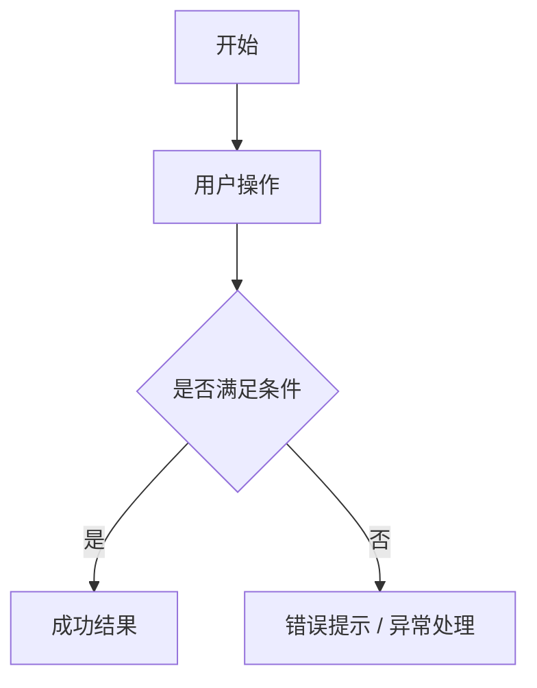

# PRD：需求标题

> 文件命名建议：`REQ-YYYY-NNN-需求简称.md`。
>
> 状态流转：`draft` → `review` → `ready` → `implemented` → `validated` → `shipped`。
> 只有 Definition of Ready 全部满足时，`ready_for_dev` 才能设为 `true`。

## 0. Definition of Ready

- [ ] 背景和业务问题清楚
- [ ] 目标和不做范围明确
- [ ] 适用项目明确
- [ ] 用户角色和权限规则明确
- [ ] 主流程、异常流程、边界条件明确
- [ ] 页面入口、核心操作、交互状态明确
- [ ] 字段、校验、数据来源明确
- [ ] 接口 / 表 / 字典 / 权限 code 需求明确或已标注待研发确认
- [ ] 验收标准编号化且可测试
- [ ] 风险点、发布注意事项和回滚方向明确

## 1. 背景

说明为什么要做该需求，包括业务问题、现状痛点、触发来源。

## 2. 目标

- 目标 1：
- 目标 2：
- 不做范围：

## 3. 适用项目与领域语言

勾选或填写：

- [ ] `pi`（引擎 / CLI / 扩展 / RPC）
- [ ] `pi-app`（Web UI / API / macOS 桌面）
- [ ] `pi-agent` 工作区（wiki / demands / 脚本，无业务代码）

### 3.1 领域语言

本次涉及或引入的术语：

| 术语 | 含义 | 避免用 | 本次是否变更 |
|---|---|---|---|
| | | | |

术语变更时同步更新 `wiki/project-overview.md` 的"领域语言"小节。

## 4. 用户角色

| 角色 | 权限 / 场景 | 说明 |
|---|---|---|
| | | |

## 5. 业务流程

用步骤描述主流程和异常流程：

1. 
2. 
3. 

### 5.1 Mermaid 流程图（可选）



### 5.2 异常 / 边界流程

- 

## 6. 功能范围

### 6.1 页面 / 入口

- 菜单路径：
- 页面路径：
- 按钮 / 操作：

### 6.2 功能点

| 功能点 | 描述 | 优先级 | 是否必须 |
|---|---|---|---|
| | | P0/P1/P2 | 是/否 |

## 7. 交互说明 / 原型草图

### 7.1 页面结构

```text
[搜索区]
- 条件 1：
- 条件 2：

[操作区]
- 主按钮：
- 次按钮：

[表格区]
| 列 1 | 列 2 | 列 3 | 操作 |

[弹窗 / 抽屉]
- 字段 1：
- 字段 2：
- 操作：确定 / 取消
```

### 7.2 交互状态

- 搜索条件：
- 表格列：
- 表单字段：
- 弹窗 / 抽屉：
- 空态 / 加载 / 错误态：
- 权限按钮：

## 8. 接口 / 数据要求

| 类型 | 名称 | 说明 |
|---|---|---|
| 接口 | | |
| 表 / 字段 | | |
| 字典 / 枚举 | | |
| 权限 code | | |

### 8.1 字段定义

| 字段 | 类型 | 必填 | 来源 | 展示 / 校验规则 |
|---|---|---|---|---|
| | | | | |

## 9. 验收标准

使用可测试语言描述，必须编号化：

- [AC-001] 给定...当...则...
- [AC-002] 权限不足时...
- [AC-003] 数据为空时...
- [AC-004] 接口异常时...

## 10. 风险点

- 权限：
- 数据一致性：
- 兼容性：
- 性能：
- 发布 / 回滚：

## 11. 相关文档

- `project-overview.md`
- `project-map.md`
- `frontend-rules.md`
- `backend-rules.md`
- `validation-rules.md`
- `ui-guidelines/`

## 12. 待确认问题

| 编号 | 问题 | 负责人 | 状态 |
|---|---|---|---|
| Q-001 | | | open/closed |
